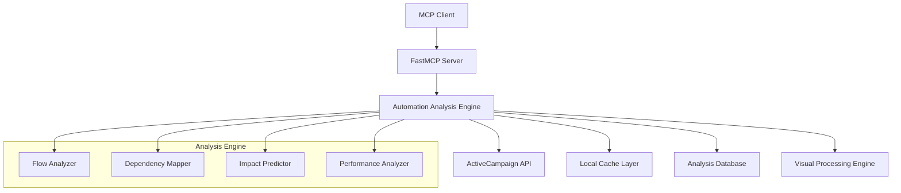

# Technical Implementation Specification: Automation Analysis Features

## Architecture Overview

### System Components



## Core Implementation Classes

### 1. AutomationAnalysisEngine

```python
from typing import Dict, List, Optional, Tuple
from dataclasses import dataclass
from datetime import datetime
import asyncio
import httpx
from fastmcp.server import FastMCP

class AutomationAnalysisEngine:
    """Core engine for automation analysis and intelligence"""
    
    def __init__(self, client: httpx.AsyncClient, cache_manager: CacheManager):
        self.client = client
        self.cache = cache_manager
        self.flow_analyzer = AutomationFlowAnalyzer(client, cache_manager)
        self.dependency_mapper = AutomationDependencyMapper(client, cache_manager)
        self.impact_predictor = ContactImpactPredictor(client, cache_manager)
        self.visual_inspector = VisualAutomationInspector(client, cache_manager)
        
    async def analyze_automation_ecosystem(self) -> AutomationEcosystem:
        """Analyze the complete automation ecosystem"""
        automations = await self._get_all_automations()
        
        # Parallel analysis of all automations
        tasks = [
            self.flow_analyzer.analyze_automation(auto['id']) 
            for auto in automations
        ]
        analyses = await asyncio.gather(*tasks, return_exceptions=True)
        
        # Build dependency graph
        dependency_graph = await self.dependency_mapper.build_dependency_graph(analyses)
        
        return AutomationEcosystem(
            automations=analyses,
            dependencies=dependency_graph,
            last_updated=datetime.utcnow()
        )
```

### 2. AutomationFlowAnalyzer

```python
class AutomationFlowAnalyzer:
    """Analyzes individual automation workflows"""
    
    async def analyze_automation(self, automation_id: str) -> AutomationAnalysis:
        """Complete analysis of a single automation"""
        
        # Get basic automation info
        automation_info = await self._get_automation_info(automation_id)
        
        # Get triggers
        triggers = await self._analyze_triggers(automation_id)
        
        # Get blocks and build flow
        blocks = await self._analyze_blocks(automation_id)
        flow = await self._build_flow_graph(blocks)
        
        # Analyze contact changes
        contact_changes = await self._analyze_contact_changes(blocks)
        
        # Get visual data if available
        visual_data = await self._get_visual_data(automation_info)
        
        return AutomationAnalysis(
            automation_id=automation_id,
            name=automation_info['name'],
            description=automation_info.get('description'),
            triggers=triggers,
            blocks=blocks,
            flow_graph=flow,
            contact_changes=contact_changes,
            visual_data=visual_data,
            analysis_timestamp=datetime.utcnow()
        )
    
    async def _analyze_triggers(self, automation_id: str) -> List[TriggerInfo]:
        """Analyze automation triggers"""
        response = await self.client.get(f'automations/{automation_id}/triggers')
        triggers_data = response.json()['automationTriggers']
        
        triggers = []
        for trigger_data in triggers_data:
            trigger_info = await self._parse_trigger(trigger_data)
            triggers.append(trigger_info)
            
        return triggers
    
    async def _parse_trigger(self, trigger_data: Dict) -> TriggerInfo:
        """Parse trigger data into structured format"""
        trigger_type = trigger_data['type']
        related_id = trigger_data.get('relid')
        
        # Resolve related entity name
        related_name = await self._resolve_entity_name(trigger_type, related_id)
        
        return TriggerInfo(
            trigger_id=trigger_data['id'],
            trigger_type=trigger_type,
            related_id=related_id,
            related_name=related_name,
            conditions=trigger_data.get('params', {}),
            multi_entry=trigger_data.get('multientry', False)
        )
    
    async def _analyze_blocks(self, automation_id: str) -> List[BlockInfo]:
        """Analyze automation blocks"""
        response = await self.client.get(f'automations/{automation_id}/blocks')
        blocks_data = response.json()['automationBlocks']
        
        blocks = []
        for block_data in blocks_data:
            block_info = await self._parse_block(block_data)
            blocks.append(block_info)
            
        return sorted(blocks, key=lambda x: x.order)
    
    async def _parse_block(self, block_data: Dict) -> BlockInfo:
        """Parse block data into structured format"""
        block_type = block_data['type']
        params = block_data.get('params', {})
        
        # Generate human-readable description
        description = await self._generate_block_description(block_type, params)
        
        # Determine if this block affects contacts
        affects_contact = self._block_affects_contact(block_type)
        
        return BlockInfo(
            block_id=block_data['id'],
            block_type=block_type,
            order=block_data['ordernum'],
            description=description,
            parameters=params,
            affects_contact=affects_contact,
            parent_id=block_data.get('parent'),
            automation_id=block_data['automation']
        )
    
    async def _generate_block_description(self, block_type: str, params: Dict) -> str:
        """Generate human-readable description for a block"""
        if block_type == 'send':
            campaign_id = params.get('campaignid')
            if campaign_id:
                campaign_name = await self._get_campaign_name(campaign_id)
                return f"Send email campaign: {campaign_name}"
            return "Send email campaign"
            
        elif block_type == 'dealstage':
            stage_id = params.get('stage')
            if stage_id:
                stage_name = await self._get_deal_stage_name(stage_id)
                return f"Move to deal stage: {stage_name}"
            return "Change deal stage"
            
        elif block_type == 'if':
            segment_id = params.get('segmentid')
            if segment_id:
                segment_name = await self._get_segment_name(segment_id)
                return f"Check if contact matches: {segment_name}"
            return "Conditional check"
            
        elif block_type == 'wait':
            return f"Wait {params.get('wait_time', 'specified time')}"
            
        elif block_type == 'sub':
            list_id = params.get('listid')
            if list_id:
                list_name = await self._get_list_name(list_id)
                return f"Subscribe to list: {list_name}"
            return "Subscribe to list"
            
        elif block_type == 'layer':
            title = params.get('title', 'External integration')
            return f"External action: {title}"
            
        else:
            return f"{block_type.title()} action"
```

### 3. AutomationDependencyMapper

```python
class AutomationDependencyMapper:
    """Maps dependencies between automations"""
    
    async def build_dependency_graph(self, analyses: List[AutomationAnalysis]) -> DependencyGraph:
        """Build complete dependency graph"""
        nodes = []
        connections = []
        
        # Create nodes for each automation
        for analysis in analyses:
            node = AutomationNode(
                automation_id=analysis.automation_id,
                name=analysis.name,
                triggers=analysis.triggers,
                outputs=analysis.contact_changes
            )
            nodes.append(node)
        
        # Find connections between automations
        for source_analysis in analyses:
            for target_analysis in analyses:
                if source_analysis.automation_id != target_analysis.automation_id:
                    connection = await self._find_connection(source_analysis, target_analysis)
                    if connection:
                        connections.append(connection)
        
        return DependencyGraph(nodes=nodes, connections=connections)
    
    async def _find_connection(self, source: AutomationAnalysis, target: AutomationAnalysis) -> Optional[AutomationConnection]:
        """Find if source automation can trigger target automation"""
        
        # Check if source outputs match target triggers
        for output in source.contact_changes:
            for trigger in target.triggers:
                if self._output_matches_trigger(output, trigger):
                    return AutomationConnection(
                        source_automation=source.automation_id,
                        target_automation=target.automation_id,
                        connection_type=self._get_connection_type(output, trigger),
                        trigger_condition=self._describe_trigger_condition(output, trigger),
                        confidence=self._calculate_confidence(output, trigger)
                    )
        
        return None
    
    def _output_matches_trigger(self, output: ContactChange, trigger: TriggerInfo) -> bool:
        """Check if an output can trigger another automation"""
        
        # List subscription triggers
        if output.change_type == 'add_to_list' and trigger.trigger_type == 'subscribe':
            return output.target_id == trigger.related_id
        
        # Tag triggers
        if output.change_type == 'add_tag' and trigger.trigger_type == 'tag_added':
            return output.target_id == trigger.related_id
        
        # Deal stage triggers
        if output.change_type == 'change_deal_stage' and trigger.trigger_type == 'deal_stage':
            return output.target_id == trigger.related_id
        
        # Custom field triggers
        if output.change_type == 'update_field' and trigger.trigger_type == 'field_updated':
            return output.target_id == trigger.related_id
        
        return False
```

### 4. ContactImpactPredictor

```python
class ContactImpactPredictor:
    """Predicts impact of automations on contacts"""
    
    async def predict_contact_path(self, contact_id: str, automation_id: str) -> ContactPath:
        """Predict how a contact will flow through an automation"""
        
        # Get contact data
        contact = await self._get_contact_data(contact_id)
        
        # Get automation analysis
        analysis = await self.flow_analyzer.analyze_automation(automation_id)
        
        # Simulate contact flow
        path = await self._simulate_contact_flow(contact, analysis)
        
        return path
    
    async def _simulate_contact_flow(self, contact: Dict, analysis: AutomationAnalysis) -> ContactPath:
        """Simulate contact flowing through automation"""
        path_steps = []
        current_blocks = [block for block in analysis.blocks if block.block_type == 'start']
        
        while current_blocks:
            next_blocks = []
            
            for block in current_blocks:
                step_result = await self._simulate_block_execution(contact, block, analysis)
                path_steps.append(step_result)
                
                # Determine next blocks based on block type and conditions
                if block.block_type == 'if':
                    # Evaluate condition
                    condition_met = await self._evaluate_condition(contact, block.parameters)
                    next_block_id = block.parameters.get('if1' if condition_met else 'if0')
                    if next_block_id:
                        next_block = self._find_block_by_id(analysis.blocks, next_block_id)
                        if next_block:
                            next_blocks.append(next_block)
                else:
                    # Find sequential next blocks
                    sequential_blocks = self._find_next_blocks(block, analysis.blocks)
                    next_blocks.extend(sequential_blocks)
            
            current_blocks = next_blocks
        
        return ContactPath(
            contact_id=contact['id'],
            automation_id=analysis.automation_id,
            steps=path_steps,
            predicted_outcome=self._predict_final_outcome(path_steps)
        )
    
    async def _simulate_block_execution(self, contact: Dict, block: BlockInfo, analysis: AutomationAnalysis) -> PathStep:
        """Simulate execution of a single block"""
        
        if block.block_type == 'send':
            # Simulate email send
            campaign_id = block.parameters.get('campaignid')
            campaign_name = await self._get_campaign_name(campaign_id)
            
            return PathStep(
                block_id=block.block_id,
                block_type=block.block_type,
                action_taken=f"Send email: {campaign_name}",
                contact_changes=[],
                timestamp_offset=self._calculate_time_offset(block),
                success_probability=0.95  # Assume high success rate for email sends
            )
        
        elif block.block_type == 'dealstage':
            # Simulate deal stage change
            stage_id = block.parameters.get('stage')
            stage_name = await self._get_deal_stage_name(stage_id)
            
            contact_change = ContactChange(
                change_type='change_deal_stage',
                target_id=stage_id,
                target_name=stage_name,
                description=f"Move to deal stage: {stage_name}"
            )
            
            return PathStep(
                block_id=block.block_id,
                block_type=block.block_type,
                action_taken=f"Move to deal stage: {stage_name}",
                contact_changes=[contact_change],
                timestamp_offset=self._calculate_time_offset(block),
                success_probability=0.98
            )
        
        # Add more block type simulations...
        
        return PathStep(
            block_id=block.block_id,
            block_type=block.block_type,
            action_taken=block.description,
            contact_changes=[],
            timestamp_offset=self._calculate_time_offset(block),
            success_probability=0.9
        )
```

## Data Models

### Core Data Structures

```python
@dataclass
class AutomationEcosystem:
    automations: List[AutomationAnalysis]
    dependencies: DependencyGraph
    last_updated: datetime
    
@dataclass
class AutomationAnalysis:
    automation_id: str
    name: str
    description: Optional[str]
    triggers: List[TriggerInfo]
    blocks: List[BlockInfo]
    flow_graph: FlowGraph
    contact_changes: List[ContactChange]
    visual_data: Optional[VisualData]
    analysis_timestamp: datetime
    
@dataclass
class TriggerInfo:
    trigger_id: str
    trigger_type: str  # "subscribe", "tag_added", "deal_stage", etc.
    related_id: Optional[str]
    related_name: Optional[str]
    conditions: Dict[str, Any]
    multi_entry: bool
    
@dataclass
class BlockInfo:
    block_id: str
    block_type: str
    order: int
    description: str
    parameters: Dict[str, Any]
    affects_contact: bool
    parent_id: Optional[str]
    automation_id: str
    
@dataclass
class ContactChange:
    change_type: str  # "add_tag", "change_deal_stage", "add_to_list", etc.
    target_id: str
    target_name: str
    description: str
    
@dataclass
class DependencyGraph:
    nodes: List[AutomationNode]
    connections: List[AutomationConnection]
    
@dataclass
class AutomationConnection:
    source_automation: str
    target_automation: str
    connection_type: str
    trigger_condition: str
    confidence: float
    
@dataclass
class ContactPath:
    contact_id: str
    automation_id: str
    steps: List[PathStep]
    predicted_outcome: Dict[str, Any]
    
@dataclass
class PathStep:
    block_id: str
    block_type: str
    action_taken: str
    contact_changes: List[ContactChange]
    timestamp_offset: int  # seconds from automation start
    success_probability: float
```

## MCP Server Integration

### Resource Handlers

```python
# In server.py
from automation_analysis import AutomationAnalysisEngine

# Initialize analysis engine
analysis_engine = AutomationAnalysisEngine(client, cache_manager)

@mcp.resource("automation_analysis/{automation_id}")
async def get_automation_analysis(automation_id: str) -> str:
    """Get complete automation analysis"""
    analysis = await analysis_engine.flow_analyzer.analyze_automation(automation_id)
    return json.dumps(analysis, cls=AutomationAnalysisEncoder)

@mcp.resource("automation_dependencies")
async def get_automation_dependencies() -> str:
    """Get automation dependency graph"""
    ecosystem = await analysis_engine.analyze_automation_ecosystem()
    return json.dumps(ecosystem.dependencies, cls=DependencyGraphEncoder)

@mcp.resource("contact_journey/{contact_id}")
async def get_contact_journey(contact_id: str) -> str:
    """Get contact's journey through automations"""
    journey = await analysis_engine.impact_predictor.get_contact_journey(contact_id)
    return json.dumps(journey, cls=ContactJourneyEncoder)
```

### Tool Handlers

```python
@mcp.tool()
async def analyze_automation_cascade(automation_id: str, proposed_changes: List[Dict]) -> Dict:
    """Analyze potential cascade effects of automation changes"""
    
    # Get current analysis
    current_analysis = await analysis_engine.flow_analyzer.analyze_automation(automation_id)
    
    # Apply proposed changes
    modified_analysis = await analysis_engine.apply_hypothetical_changes(
        current_analysis, proposed_changes
    )
    
    # Find cascading effects
    cascades = await analysis_engine.dependency_mapper.find_cascading_effects(
        current_analysis, modified_analysis
    )
    
    return {
        "automation_id": automation_id,
        "proposed_changes": proposed_changes,
        "cascading_automations": cascades,
        "impact_summary": analysis_engine.summarize_impact(cascades)
    }

@mcp.tool()
async def predict_contact_automation_path(contact_id: str, automation_id: str) -> Dict:
    """Predict how a contact will flow through an automation"""
    
    path = await analysis_engine.impact_predictor.predict_contact_path(
        contact_id, automation_id
    )
    
    return {
        "contact_id": contact_id,
        "automation_id": automation_id,
        "predicted_path": path,
        "completion_probability": path.predicted_outcome.get("completion_probability"),
        "estimated_duration": path.predicted_outcome.get("estimated_duration")
    }

@mcp.tool()
async def detect_automation_conflicts() -> Dict:
    """Detect potentially conflicting automations"""
    
    ecosystem = await analysis_engine.analyze_automation_ecosystem()
    conflicts = await analysis_engine.detect_conflicts(ecosystem)
    
    return {
        "conflicts_found": len(conflicts),
        "conflicts": conflicts,
        "recommendations": [
            analysis_engine.generate_conflict_resolution(conflict)
            for conflict in conflicts
        ]
    }
```

## Caching Strategy

### Multi-Level Cache

```python
class CacheManager:
    def __init__(self):
        self.memory_cache = {}  # In-memory for frequently accessed data
        self.disk_cache = DiskCache()  # Persistent cache for expensive computations
        self.db_cache = DatabaseCache()  # Database for structured data
    
    async def get_automation_analysis(self, automation_id: str) -> Optional[AutomationAnalysis]:
        # Check memory first
        if automation_id in self.memory_cache:
            return self.memory_cache[automation_id]
        
        # Check disk cache
        cached_data = await self.disk_cache.get(f"automation_{automation_id}")
        if cached_data and not self._is_expired(cached_data):
            analysis = self._deserialize_analysis(cached_data)
            self.memory_cache[automation_id] = analysis
            return analysis
        
        return None
    
    async def cache_automation_analysis(self, analysis: AutomationAnalysis):
        # Cache in memory
        self.memory_cache[analysis.automation_id] = analysis
        
        # Cache on disk
        serialized = self._serialize_analysis(analysis)
        await self.disk_cache.set(f"automation_{analysis.automation_id}", serialized)
        
        # Cache in database for querying
        await self.db_cache.store_analysis(analysis)
```

## Performance Optimizations

### Parallel Processing

```python
class ParallelAnalyzer:
    def __init__(self, max_concurrent: int = 10):
        self.semaphore = asyncio.Semaphore(max_concurrent)
    
    async def analyze_multiple_automations(self, automation_ids: List[str]) -> List[AutomationAnalysis]:
        """Analyze multiple automations in parallel"""
        
        async def analyze_single(automation_id: str) -> AutomationAnalysis:
            async with self.semaphore:
                return await self.flow_analyzer.analyze_automation(automation_id)
        
        tasks = [analyze_single(aid) for aid in automation_ids]
        results = await asyncio.gather(*tasks, return_exceptions=True)
        
        # Filter out exceptions and log errors
        analyses = []
        for i, result in enumerate(results):
            if isinstance(result, Exception):
                logger.error(f"Failed to analyze automation {automation_ids[i]}: {result}")
            else:
                analyses.append(result)
        
        return analyses
```

### Incremental Updates

```python
class IncrementalUpdater:
    async def update_changed_automations(self) -> List[str]:
        """Update only automations that have changed"""
        
        # Get last update timestamp
        last_update = await self.cache.get_last_update_timestamp()
        
        # Get automations modified since last update
        changed_automations = await self._get_changed_automations(last_update)
        
        # Update analyses for changed automations
        updated_analyses = await self.parallel_analyzer.analyze_multiple_automations(
            changed_automations
        )
        
        # Update dependency graph incrementally
        await self.dependency_mapper.update_dependencies_incremental(updated_analyses)
        
        # Update cache timestamp
        await self.cache.set_last_update_timestamp(datetime.utcnow())
        
        return changed_automations
```

## Error Handling

### Resilient Analysis

```python
class ResilientAnalyzer:
    async def analyze_with_fallback(self, automation_id: str) -> AutomationAnalysis:
        """Analyze automation with multiple fallback strategies"""
        
        try:
            # Try full analysis
            return await self._full_analysis(automation_id)
        except APIRateLimitError:
            # Wait and retry
            await asyncio.sleep(60)
            return await self._full_analysis(automation_id)
        except APIError as e:
            if e.status_code == 404:
                # Automation doesn't exist
                raise AutomationNotFoundError(f"Automation {automation_id} not found")
            else:
                # Try partial analysis
                return await self._partial_analysis(automation_id)
        except Exception as e:
            logger.error(f"Unexpected error analyzing automation {automation_id}: {e}")
            # Return basic analysis with error info
            return await self._basic_analysis_with_error(automation_id, e)
    
    async def _partial_analysis(self, automation_id: str) -> AutomationAnalysis:
        """Perform partial analysis when full analysis fails"""
        try:
            # Get basic automation info
            automation_info = await self._get_automation_info(automation_id)
            
            # Try to get triggers (most important for dependencies)
            triggers = []
            try:
                triggers = await self._analyze_triggers(automation_id)
            except Exception:
                logger.warning(f"Failed to get triggers for automation {automation_id}")
            
            return AutomationAnalysis(
                automation_id=automation_id,
                name=automation_info.get('name', 'Unknown'),
                description=automation_info.get('description'),
                triggers=triggers,
                blocks=[],  # Empty blocks
                flow_graph=FlowGraph(nodes=[], edges=[]),
                contact_changes=[],
                visual_data=None,
                analysis_timestamp=datetime.utcnow(),
                analysis_status="partial"
            )
        except Exception as e:
            return await self._basic_analysis_with_error(automation_id, e)
```

## Testing Framework

### Unit Tests

```python
import pytest
from unittest.mock import AsyncMock, Mock

class TestAutomationFlowAnalyzer:
    @pytest.fixture
    async def analyzer(self):
        mock_client = AsyncMock()
        mock_cache = Mock()
        return AutomationFlowAnalyzer(mock_client, mock_cache)
    
    @pytest.mark.asyncio
    async def test_analyze_automation_basic(self, analyzer):
        # Mock API responses
        analyzer.client.get.side_effect = [
            Mock(json=lambda: {"automation": {"id": "13", "name": "Test Automation"}}),
            Mock(json=lambda: {"automationTriggers": [{"id": "1", "type": "subscribe", "relid": "20"}]}),
            Mock(json=lambda: {"automationBlocks": [{"id": "1", "type": "start", "ordernum": 1}]})
        ]
        
        result = await analyzer.analyze_automation("13")
        
        assert result.automation_id == "13"
        assert result.name == "Test Automation"
        assert len(result.triggers) == 1
        assert len(result.blocks) == 1
    
    @pytest.mark.asyncio
    async def test_analyze_automation_with_api_error(self, analyzer):
        # Mock API error
        analyzer.client.get.side_effect = httpx.HTTPStatusError("Not found", request=Mock(), response=Mock(status_code=404))
        
        with pytest.raises(AutomationNotFoundError):
            await analyzer.analyze_automation("999")
```

### Integration Tests

```python
class TestAutomationAnalysisIntegration:
    @pytest.mark.asyncio
    async def test_full_automation_analysis_workflow(self):
        """Test complete automation analysis workflow"""
        
        # Use real MCP client with test automation
        async with Client(mcp) as client:
            # Get automation analysis
            analysis_data = await client.read_resource('resource://automation_analysis/13')
            analysis = json.loads(analysis_data)
            
            assert 'automation_id' in analysis
            assert 'triggers' in analysis
            assert 'blocks' in analysis
            
            # Test dependency mapping
            deps_data = await client.read_resource('resource://automation_dependencies')
            dependencies = json.loads(deps_data)
            
            assert 'nodes' in dependencies
            assert 'connections' in dependencies
            
            # Test cascade prediction
            cascade_result = await client.call_tool('analyze_automation_cascade', {
                'automation_id': '13',
                'proposed_changes': [{'type': 'add_tag', 'tag_id': '5'}]
            })
            
            assert 'cascading_automations' in cascade_result
```

This technical specification provides a comprehensive implementation plan for the automation analysis features, including detailed code examples, architecture decisions, and testing strategies.

