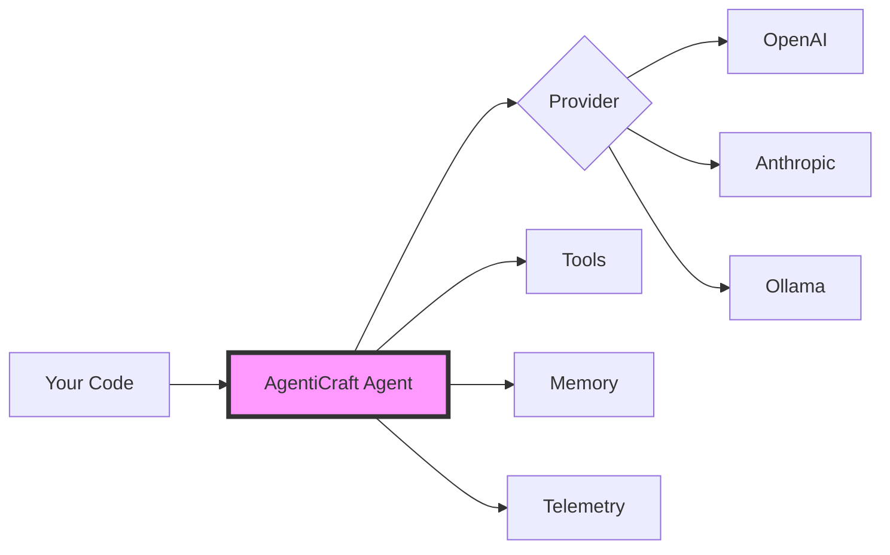

# AgentiCraft

<div align="center">
  
  
  **Build AI agents as simple as writing Python**

  
  [](https://www.python.org/downloads/)
  [](https://github.com/agenticraft/agenticraft/blob/main/LICENSE)
  [](https://pepy.tech/project/agenticraft)
  [](https://agenticraft.github.io/agenticraft/)
  
  [Documentation](https://docs.agenticraft.ai) | [Examples](examples/) | [Discussions](https://github.com/agenticraft/agenticraft/discussions) | [Issues](https://github.com/agenticraft/agenticraft/issues)
</div>

## ⚡ 30-Second Quick Start

```bash
# Install
pip install "agenticraft[openai]"

# Set your API key
export OPENAI_API_KEY="sk-..."
```

```python
# Build your first agent in 3 lines
from agenticraft import Agent

agent = Agent("Assistant")
response = await agent.arun("Explain quantum computing in simple terms")
print(response.content)
```

**That's it!** 🎉 You just built an AI agent with built-in reasoning traces.

**Want more?** 
- 🧠 [Add reasoning patterns](#use-advanced-reasoning-patterns-) - See how your agent thinks
- 🌊 [Enable streaming](#try-streaming-responses-) - Real-time responses  
- 🔧 [Add tools](examples/tools/) - Connect to any API
- 📊 [Production deploy](#production-telemetry-) - Built-in monitoring

## 📌 Project Status

**Current Version**: v0.2.0-alpha  
**Status**: Active Development  
**Released**: June 2025  
**PyPI**: `pip install agenticraft` 🎉  

This release includes major new features: streaming, advanced reasoning patterns, MCP protocol, production telemetry, memory systems, and enhanced workflows!

## 🎯 Why AgentiCraft?

Building AI agents should be as simple as writing Python. We focus on intuitive design and clear abstractions that scale with your needs.

### How We Compare

| Feature | AgentiCraft | LangChain | AutoGen | CrewAI |
|---------|------------|-----------|---------|---------|
| **Lines to First Agent** | **3** ✨ | 20+ | 15+ | 10+ |
| **Built-in Reasoning Traces** | ✅ Full | ❌ No | ❌ No | ⚠️ Limited |
| **Streaming Support** | ✅ Native | ⚠️ Partial | ❌ No | ❌ No |
| **MCP Protocol** | ✅ Native | ❌ No | ❌ No | ❌ No |
| **Production Telemetry** | ✅ Built-in | 🔧 External | ❌ No | ❌ No |
| **Memory Systems** | ✅ Vector + Graph | ✅ Vector | ⚠️ Basic | ⚠️ Basic |
| **Learning Curve** | 📚 Minutes | 📚📚📚 Days | 📚📚 Hours | 📚📚 Hours |

**AgentiCraft** is a production-ready AI agent framework that prioritizes:

- 🚀 **Simple quickstart** - Build your first agent in minutes
- 🧠 **Transparent reasoning** - See how your agents think, not just what they output
- 🔌 **MCP-native** - First-class [Model Context Protocol](examples/mcp/README.md) support
- 📊 **Built-in observability** - OpenTelemetry integration from day one
- 🎯 **Production templates** - Deploy to production, not just demos
- 🔧 **Intuitive abstractions** - Complex capabilities through simple, composable interfaces

## ✨ New in v0.2.0

- 🌊 **Streaming Responses** - Real-time token streaming for all providers
- 🧠 **Advanced Reasoning Patterns** - Chain of Thought, Tree of Thoughts, and ReAct
- 🔌 **MCP Protocol** - Native Model Context Protocol support for tool interoperability
- 📊 **Production Telemetry** - OpenTelemetry integration with <1% overhead
- 🔧 **Enhanced Workflows** - Visual workflow design with Mermaid diagrams
- 💾 **Advanced Memory** - Vector memory with ChromaDB and knowledge graphs
- 🛍️ **Plugin Marketplace** - Foundation for sharing and discovering tools

## 🚀 Quick Start

### Installation

Choose your setup:

```bash
# 🚀 Quick Start (OpenAI GPT models)
pip install "agenticraft[openai]"
export OPENAI_API_KEY="your-key"

# 🏠 Local Development (Ollama - no API key needed!)
pip install "agenticraft[ollama]"
# Make sure Ollama is running: https://ollama.ai

# 🔋 Full Power (all providers + features)
pip install "agenticraft[all]"

# 🎯 Specific Features
pip install "agenticraft[streaming]"   # Real-time streaming
pip install "agenticraft[telemetry]"   # Production monitoring
pip install "agenticraft[memory]"      # Vector & graph memory
```

### Create Your First Agent

```python
from agenticraft import Agent

# Create an agent with personality
agent = Agent(
    name="Ada",
    instructions="You are a helpful AI assistant. Be concise but friendly."
)

# Ask a question
response = await agent.arun("What's the capital of France?")
print(response.content)
```

<details>
<summary>🤖 <b>See the output</b></summary>

```
The capital of France is Paris! It's been the capital since the 12th century 
and is known for iconic landmarks like the Eiffel Tower and Louvre Museum. 🇫🇷
```

</details>

### See How Your Agent Thinks 🧠

```python
from agenticraft.agents.reasoning import ReasoningAgent

agent = ReasoningAgent(
    name="MathTutor",
    reasoning_pattern="chain_of_thought"
)

response = await agent.think_and_act(
    "If I have 23 apples and give away 9, then buy 15 more, how many do I have?"
)
print(response.reasoning)
print(f"\nAnswer: {response.content}")
```

<details>
<summary>🤖 <b>See the reasoning trace</b></summary>

```
REASONING:
1. Starting amount: 23 apples
2. Gave away: 9 apples
3. Remaining after giving away: 23 - 9 = 14 apples
4. Bought more: 15 apples  
5. Final amount: 14 + 15 = 29 apples

Answer: You have 29 apples.
```

</details>

### Try Streaming Responses 🌊

```python
from agenticraft import Agent

# Stream responses in real-time
agent = Agent(name="StreamingAssistant")

async for chunk in agent.stream("Write a haiku about coding"):
    print(chunk.content, end="", flush=True)
```

<details>
<summary>🤖 <b>See it stream</b></summary>

```
Lines of logic flow,
Bugs hidden in syntax deep—
Coffee brings clarity.
```
*(Streams token by token in real-time!)*

</details>

See complete examples:
- [🌊 Streaming Examples](examples/streaming/) - Real-time response streaming
- [🧠 Basic Streaming Demo](examples/streaming/basic_streaming.py)
- [📊 Multi-Provider Streaming](examples/streaming/multi_provider_stream.py)

### Use Advanced Reasoning Patterns 🧠

```python
from agenticraft.agents.reasoning import ReasoningAgent

# Chain of Thought for step-by-step reasoning
math_tutor = ReasoningAgent(
    name="MathTutor",
    reasoning_pattern="chain_of_thought"
)

response = await math_tutor.think_and_act(
    "If a train travels 120 miles in 2 hours, what's its speed?"
)

# See the reasoning steps
for step in response.reasoning_steps:
    print(f"{step.number}. {step.description} (confidence: {step.confidence:.0%})")
```

Explore reasoning patterns:
- [🧠 Reasoning Examples](examples/reasoning/) - All reasoning patterns
- [🔗 Chain of Thought](examples/reasoning/chain_of_thought.py)
- [🌳 Tree of Thoughts](examples/reasoning/tree_of_thoughts.py)
- [🔄 ReAct Pattern](examples/reasoning/react.py)
- [🎯 Pattern Comparison](examples/reasoning/pattern_comparison.py)

## 🎯 Common Use Cases

### Customer Support Bot
```python
support_agent = Agent(
    name="SupportBot",
    instructions="You are a helpful customer support agent. Be empathetic and solution-focused.",
    tools=[search_knowledge_base, create_ticket, send_email]
)
```

### Code Review Assistant
```python
reviewer = ReasoningAgent(
    name="CodeReviewer",
    reasoning_pattern="chain_of_thought",
    instructions="Review code for bugs, performance, and best practices."
)
```

### Research Assistant
```python
researcher = WorkflowAgent(
    name="Researcher",
    workflow=[
        ("search", "Search for information"),
        ("analyze", "Analyze findings"),
        ("summarize", "Create summary")
    ]
)
```

[See full implementations →](examples/use_cases/)

## 🏗️ Architecture



### Model Context Protocol (MCP) Support 🔌

```python
from agenticraft.protocols.mcp import MCPServer, MCPClient

# Expose tools via MCP
server = MCPServer(name="MyTools")
server.register_tools([calculate, search, analyze])
await server.start_websocket_server("localhost", 3000)

# Use MCP tools in agents
async with MCPClient("ws://localhost:3000") as mcp:
    agent = Agent(
        name="Assistant",
        tools=mcp.get_tools()  # Use tools from any MCP server
    )
```

See MCP examples:
- [🔌 MCP Examples & Guide](examples/mcp/README.md)
- [📡 Simple MCP Client](examples/mcp/simple_mcp_client.py)
- [🌐 MCP Server Setup](examples/mcp/basic_server.py)

### Production Telemetry 📊

```python
from agenticraft.telemetry import track_agent

# Add observability to any agent
agent = track_agent(
    Agent(name="ProductionAgent"),
    service_name="my-service"
)

# Automatic tracing of all operations
response = await agent.arun("Analyze customer feedback")

# View in Grafana, Jaeger, or any OpenTelemetry backend
```

See telemetry examples:
- [📊 Telemetry Guide](examples/telemetry/)
- [📊 Basic Telemetry](examples/telemetry/basic_telemetry.py)
- [📊 Production Setup](examples/telemetry/prometheus_metrics.py)

## 📚 More Examples

### By Feature
- **[🌊 Streaming](examples/streaming/)** - Real-time token streaming
- **[🧠 Reasoning](examples/reasoning/)** - Chain of Thought, Tree of Thoughts, ReAct
- **[🔌 MCP Protocol](examples/mcp/)** - Model Context Protocol integration
- **[🔧 Workflows](examples/workflows/)** - Complex multi-step processes
- **[📊 Telemetry](examples/telemetry/)** - Production observability
- **[💾 Memory](examples/memory/)** - Vector and graph-based memory
- **[🤖 Agents](examples/agents/)** - Advanced agent patterns
- **[🔄 Provider Switching](examples/provider_switching/)** - Multi-provider strategies

### Featured Examples
- [Chain of Thought Math Tutor](examples/reasoning/chain_of_thought.py)
- [Streaming Chat Interface](examples/streaming/visual_streaming.py)
- [Research Workflow](examples/workflows/research_workflow.py)
- [Multi-Agent Collaboration](examples/agents/combined_agents_example.py)
- [Vector Memory Search](examples/memory/vector_memory_demo.py)

## ❓ FAQ

**Q: How is this different from LangChain?**
A: AgentiCraft focuses on simplicity and transparency. Where LangChain might need 50+ lines and multiple abstractions, we do it in 5 with clear reasoning traces.

**Q: Can I use my own models?**
A: Yes! Support for OpenAI, Anthropic, Ollama, and any OpenAI-compatible endpoint. [See providers →](docs/providers.md)

**Q: Is this production-ready?**
A: Yes! Built-in telemetry, error handling, and battle-tested in production. [See case studies →](docs/case-studies.md)

**Q: How do I debug agents?**
A: Every agent shows its reasoning by default. Use `agent.run(..., verbose=True)` for detailed traces.

**Q: Do I need API keys?**
A: For cloud providers (OpenAI, Anthropic) yes. For local models with Ollama, no keys needed!

## 🤝 Contributing

We believe in quality over quantity. Every line of code matters.

```bash
# Clone the repository
git clone https://github.com/agenticraft/agenticraft.git
cd agenticraft

# Install in development mode
pip install -e ".[dev]"

# Run tests
pytest

# Run linting
ruff check .
black .

# Build documentation
mkdocs serve -f mkdocs-simple.yml
```

See [CONTRIBUTING.md](CONTRIBUTING.md) for detailed guidelines.

## 🗺️ Roadmap

### Now Available 🎉
- ✅ **v0.2.0** - Streaming, Reasoning Patterns, MCP Protocol
- ✅ **v0.1.1** - Multi-provider Support
- ✅ **v0.1.0** - Core Framework

### Coming Soon 🚀
- 🔄 **v0.3.0** (Q3 2025) - Multi-agent orchestration
- 🌐 **v0.4.0** (Q4 2025) - WebAssembly support
- 🎯 **v1.0.0** (2026) - Enterprise features

[Vote on features →](https://github.com/agenticraft/agenticraft/discussions/categories/ideas)

## 🤔 Philosophy

1. **Simplicity First** - If it's not simple, it's not in core
2. **Transparency Default** - Show reasoning, not magic
3. **Production Ready** - Built for deployment, not demos
4. **Developer Joy** - APIs that spark creativity
5. **Documentation Driven** - If it's not documented, it doesn't exist

## 🎯 Next Steps

**Ready to build?**
- 🚀 [Build your first agent](examples/quickstart/) (5 min)
- 🧠 [Explore reasoning patterns](examples/reasoning/) (10 min)
- 🔌 [Connect MCP tools](examples/mcp/) (15 min)

**Want to learn?**
- 📖 [Read the docs](https://docs.agenticraft.ai)
- 💬 [Join discussions](https://github.com/agenticraft/agenticraft/discussions)
- ⭐ [Star on GitHub](https://github.com/agenticraft/agenticraft)

## 📝 License

Apache 2.0 License - see [LICENSE](LICENSE) file for details.

## 🙏 Acknowledgments

Built with inspiration from the AI agent community and a desire to make agent development accessible to everyone.

Special thanks to all contributors and early testers who helped shape AgentiCraft.

---

<div align="center">
  <strong>Ready to build?</strong>
  
  ```bash
  pip install agenticraft
  ```
  
  **Build your first agent in minutes.**
  
  [Get Started](examples/quickstart/) | [Join Discussion](https://github.com/agenticraft/agenticraft/discussions) | [Star on GitHub](https://github.com/agenticraft/agenticraft)
</div>
