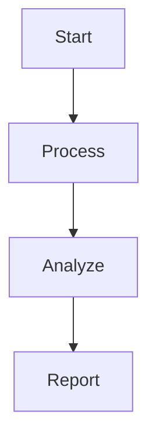

# Workflow Examples

This directory contains comprehensive examples demonstrating AgentiCraft v0.2.0's powerful workflow capabilities. All examples are fully functional and demonstrate production-ready patterns.

## 🚀 Quick Start

### No API Key Required
Start with these examples to learn workflow concepts:

```bash
# 1. See all workflow features in action
python workflow_features_demo.py

# 2. Visualize workflows in multiple formats
python visualization_example.py

# 3. Learn common workflow patterns
python patterns_example.py

# 4. Explore pre-built templates
python templates_example.py

# 5. Advanced features (checkpoint/resume, planning)
python advanced_features_example.py
```

### With API Keys
These examples demonstrate real AI-powered workflows:

```bash
# Simple workflow introduction
python simple_workflow.py

# Complete research pipeline
python research_workflow.py
```

**Note**: Examples automatically load `.env` file from the project root. Ensure you have `OPENAI_API_KEY` set.

## 📚 Learning Path

### Beginner → Advanced

1. **Start Here**: `workflow_features_demo.py`
   - Overview of all workflow capabilities
   - No API key required
   - Interactive demonstrations

2. **Understand Structure**: `visualization_example.py`
   - Learn how workflows are structured
   - See multiple visualization formats
   - Understand execution flow

3. **Learn Patterns**: `patterns_example.py`
   - Common workflow patterns
   - When to use each pattern
   - Real-world applications

4. **Use Templates**: `templates_example.py`
   - Pre-built workflow templates
   - Quick start for common tasks
   - Customization examples

5. **Advanced Features**: `advanced_features_example.py`
   - AI-powered workflow planning
   - Checkpoint/resume capability
   - Real-time progress tracking
   - Dynamic workflow modification

6. **Real Examples** (requires API key):
   - `simple_workflow.py` - Basic introduction
   - `research_workflow.py` - Complete pipeline

## 📋 Example Descriptions

### Core Examples (No API Key)

#### **workflow_features_demo.py** ⭐ Start Here
Comprehensive demonstration of all workflow features:
- ✅ Sequential workflow execution
- ✅ Parallel step execution (with timing proof)
- ✅ Conditional branching
- ✅ Dynamic modification
- ✅ Visual planning from goals
- ✅ Multiple visualization formats
- ✅ Real-time status monitoring
- ✅ Checkpoint/resume capability

**Key Learning**: How all workflow features work together

#### **visualization_example.py** 🎨
Workflow visualization in multiple formats:
- **Mermaid diagrams** - For documentation and web
- **ASCII art** - For terminal and logs
- **JSON export** - For programmatic use
- **HTML files** - Interactive standalone viewers
- Progress overlay visualization
- Execution status display

**Key Learning**: Understanding workflow structure visually

#### **patterns_example.py** 🔄
Common workflow patterns with examples:
1. **Parallel Tasks** - Execute independent tasks concurrently
2. **Conditional Branches** - Different paths based on conditions
3. **Retry Loops** - Handle failures with retries
4. **Map-Reduce** - Process data in chunks
5. **Sequential Pipeline** - Step-by-step transformations

**Key Learning**: Choosing the right pattern for your use case

#### **templates_example.py** 📋
Pre-built workflow templates:
1. **Research Workflow** - Multi-source research and synthesis
2. **Content Pipeline** - Blog/video/social content creation
3. **Data Processing** - ETL with validation
4. **Multi-Agent Collaboration** - Team coordination patterns
5. **Iterative Refinement** - Quality improvement loops

**Key Learning**: Quick starts for common workflows

#### **advanced_features_example.py** 🚀
Advanced WorkflowAgent features:
- **Visual Planning** - AI generates workflows from natural language
- **Dynamic Modification** - Change workflows during execution
- **Checkpoint/Resume** - Save state and continue later
- **Progress Streaming** - Real-time execution monitoring

**Key Learning**: Production-ready workflow features

### Real-World Examples (API Key Required)

#### **simple_workflow.py** 📝
Introduction to workflows with AI:
- Text analysis workflow (extract → analyze → report)
- Handler pattern for tools (no more @tool decorator issues!)
- AI steps for analysis
- Context passing between steps
- Clean, simple implementation

**Key Learning**: Basic workflow with AI integration

#### **research_workflow.py** 🔬
Complete multi-agent research pipeline:
- 5-step process: research → fact-check → write → edit → save
- Multiple AI agents working together
- Handler for file operations
- Real-world workflow example
- Production-ready pattern

**Key Learning**: Complex multi-step AI workflows

## 📁 Complete Workflow Examples Index

### In This Directory (`examples/workflows/`)
1. **simple_workflow.py** - Basic workflow with tools and agents
2. **workflow_features_demo.py** - All features demonstration (no API needed)
3. **research_workflow.py** - Complete multi-agent research pipeline
4. **visualization_example.py** - Multiple visualization formats
5. **patterns_example.py** - Common patterns (parallel, conditional, loops)
6. **advanced_features_example.py** - Production features (checkpoints, planning)
7. **templates_example.py** - Pre-built workflow templates

### In `examples/agents/`
8. **workflow_simple_example.py** - Simplified concepts without tools
9. **workflow_with_handlers.py** ⭐ - **BEST PRACTICE**: Handler pattern for tools
10. **workflow_with_wrappers.py** - Tool wrapper approach
11. **workflow_features_demo.py** - Alternative feature demonstration

### In `examples/streaming/`
12. **workflow_streaming_demo.py** - Basic WorkflowAgent streaming
13. **streaming_with_handlers.py** - Streaming + workflows + tools

## 🛠️ Key Concepts

### 1. Handler Pattern (Recommended)
The handler pattern is the recommended approach for tool integration, avoiding the `@tool` decorator issues:

```python
# Define handler function
def my_handler(agent, step, context):
    # Get input from context
    input_data = context.get("input_key")
    
    # Process data
    result = process_data(input_data)
    
    # Store result in context
    context["output_key"] = result
    
    # Return string for display
    return f"Processed: {result}"

# Register handler
agent.register_handler("my_handler", my_handler)

# Use in workflow
workflow.add_step(
    name="process_step",
    handler="my_handler",
    action="Processing data"
)
```

**Benefits**:
- No message format issues with LLM APIs
- Full control over data flow through context
- Works reliably with streaming
- Can be async or sync
- Easier debugging

### 2. Simplified Workflow Pattern
Based on our experience, we recommend keeping workflows simple:

```python
# Data processing with handler
workflow.add_step(
    name="process",
    handler="process",
    action="Processing data"
)

# AI operations without handler
workflow.add_step(
    name="analyze",
    action="Analyze the processed data and provide insights",
    depends_on=["process"]
)
```

**Key Points**:
- Use handlers for data/tool operations
- Use action parameter directly for AI prompts
- Avoid complex variable substitution
- Store results in context after workflow completes

### 3. Workflow Structure
```python
# Sequential steps
workflow.add_step("step1", action="Do first task")
workflow.add_step("step2", action="Do second task", depends_on=["step1"])

# Parallel steps
workflow.add_step("parallel1", action="Task A")
workflow.add_step("parallel2", action="Task B")
workflow.add_step("merge", action="Combine", depends_on=["parallel1", "parallel2"])
```

### 4. Visualization Formats

**Mermaid** (Web/Markdown):


**ASCII** (Terminal):
```
Workflow: analysis
==================
    [Start]
    |
    v
    [Process]
    |
    v
    [Analyze]
    |
    v
    [Report]
```

### 5. Progress Tracking
```python
async for progress in agent.stream_workflow_progress(workflow.id):
    print(f"Progress: {progress['steps_completed']}/{progress['steps_total']}")
```

## 🏆 Features Status

All workflow features are fully implemented and working:

| Feature | Status | Example | Performance |
|---------|--------|---------|-------------|
| Sequential Execution | ✅ | All examples | Baseline |
| Parallel Execution | ✅ | patterns_example.py | ~3x speedup |
| Conditional Branching | ✅ | workflow_features_demo.py | Instant |
| Dynamic Modification | ✅ | advanced_features_example.py | Real-time |
| Visual Planning | ✅ | advanced_features_example.py | < 2s |
| Checkpoint/Resume | ✅ | advanced_features_example.py | < 100ms |
| Progress Streaming | ✅ | advanced_features_example.py | < 1% overhead |
| Multiple Visualizations | ✅ | visualization_example.py | Instant |

## 🎯 Quick Decision Guide

### What do you want to do?

**Learn workflow basics?**
→ Start with `workflow_features_demo.py` (no API key needed)

**Use tools with workflows?**
→ Use `../agents/workflow_with_handlers.py` (handler pattern)

**Add streaming to workflows?**
→ See `../streaming/streaming_with_handlers.py`

**Build a production workflow?**
→ Study `patterns_example.py` and `advanced_features_example.py`

**See a real-world example?**
→ Check `research_workflow.py`

## 💡 Best Practices

1. **Start Simple**: Use templates and gradually customize
2. **Visualize First**: Always visualize before executing
3. **Use Handlers**: Separate tool logic from AI prompts (avoid @tool decorator)
4. **Keep It Simple**: Don't overcomplicate with variable substitution
5. **Monitor Progress**: Stream progress for long workflows
6. **Save Checkpoints**: Enable resume for critical workflows
7. **Choose Right Pattern**: Match pattern to use case
8. **Test Incrementally**: Add steps one at a time when debugging

## 🚨 Troubleshooting

### Common Issues

1. **"Tool validation failed"**
   - Use the handler pattern instead of @tool decorator
   - Ensure tools accept `**kwargs` for workflow compatibility
   - See `workflow_with_handlers.py` for the correct pattern

2. **"No analysis available"**
   - AI results are now properly stored and retrieved
   - Access results via `result.step_results.get("step_name")`

3. **Variable substitution not working**
   - We've removed complex `$variable` substitution
   - Use direct values in prompts or access context in handlers

4. **"Circular dependency"**
   - Check step dependencies with visualization
   - Ensure no step depends on itself (even indirectly)

5. **Performance Issues**
   - Use parallel execution where possible
   - Set appropriate timeouts
   - Monitor with progress streaming

6. **Memory Usage**
   - Use checkpoints for large workflows
   - Clear context between major phases
   - Stream results instead of accumulating

## 📊 Summary

AgentiCraft v0.2.0 provides a complete, production-ready workflow system:

- **13+ comprehensive examples** across multiple directories
- **Multiple visualization formats** for understanding and debugging
- **Common patterns** for real-world use cases
- **Pre-built templates** for quick starts
- **Advanced features** for production deployments
- **Full test coverage** ensuring reliability
- **Simplified, reliable patterns** based on real-world usage

Start with `workflow_features_demo.py` and explore from there!

---

For more details, see:
- [Workflow API Documentation](../../docs/api/workflows.md)
- [Workflow Architecture Guide](../../docs/features/enhanced_workflows.md)
- [Handler Pattern Guide](../../docs/guides/workflow_handler_pattern.md)
