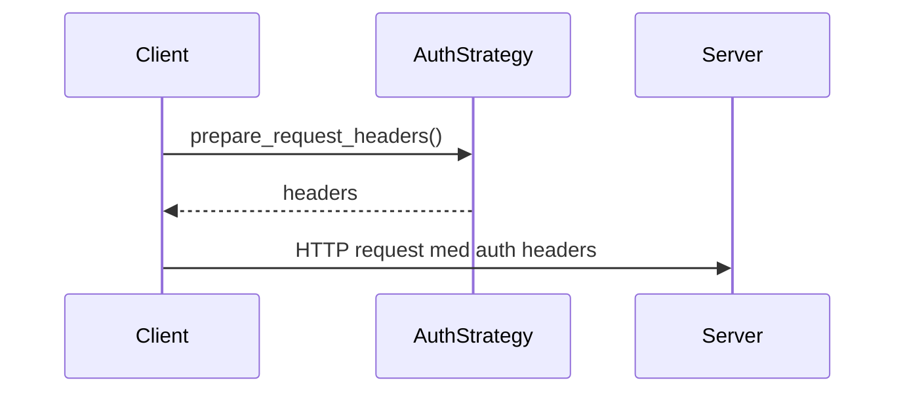

# apiconfig.auth.strategies

``apiconfig.auth.strategies`` contains the built‑in authentication
strategies used by **apiconfig**.  Each strategy implements the
`AuthStrategy` interface and can be plugged into a `ClientConfig` to
attach credentials to outgoing HTTP requests.

## Innhold

- `api_key.py` – API‑nøkkel autentisering via header eller query‑parameter.
- `basic.py` – HTTP Basic autentisering.
- `bearer.py` – Bearer token med valgfri utløpstid og refresh‑støtte.
- `custom.py` – Brukerdefinerte strategier med egne callbacks.
- `__init__.py` – re‑eksporterer alle strategiene for enkel import.

## Eksempel på bruk

```python
from datetime import datetime, timedelta, timezone
from apiconfig import ClientConfig
from apiconfig.auth.strategies import ApiKeyAuth, BasicAuth, BearerAuth, CustomAuth

# API‑nøkkel i header
header_auth = ApiKeyAuth(api_key="secret", header_name="X-API-Key")

# Enkel Basic Auth
basic_auth = BasicAuth(username="user", password="pass")

# Bearer token med utløpstid
bearer_auth = BearerAuth(
    access_token="token",
    expires_at=datetime.now(timezone.utc) + timedelta(hours=1),
)

# Custom med callback
custom_auth = CustomAuth(header_callback=lambda: {"X-Custom": "value"})

config = ClientConfig(hostname="api.example.com", auth_strategy=header_auth)
```

## Nøkkelklasser

| Klasse | Beskrivelse |
| ------ | ----------- |
| `ApiKeyAuth` | Sender API‑nøkkel enten i en header eller som query‑parameter. |
| `BasicAuth` | Legger til `Authorization: Basic ...` header basert på brukernavn og passord. |
| `BearerAuth` | Bruker bearer token og kan oppdateres hvis `expires_at` er satt og refresh‑funksjon er tilgjengelig. |
| `CustomAuth` | Tillater helt egne callbacks for både headers, parameters og refresh‑logikk. |

### Designmønster

Strategiene følger **Strategy‑mønsteret**: alle implementerer
`AuthStrategy` og kan byttes ut uten at resten av klientkoden endres.

## Sekvensdiagram



## Testinstruksjoner

Installer avhengigheter og kjør enhetene for denne modulen:

```bash
python -m pip install -e .
python -m pip install pytest
pytest tests/unit/auth/strategies -q
```

## Status

Stabil – strategiene brukes av andre deler av **apiconfig** og har
egen testdekning.
