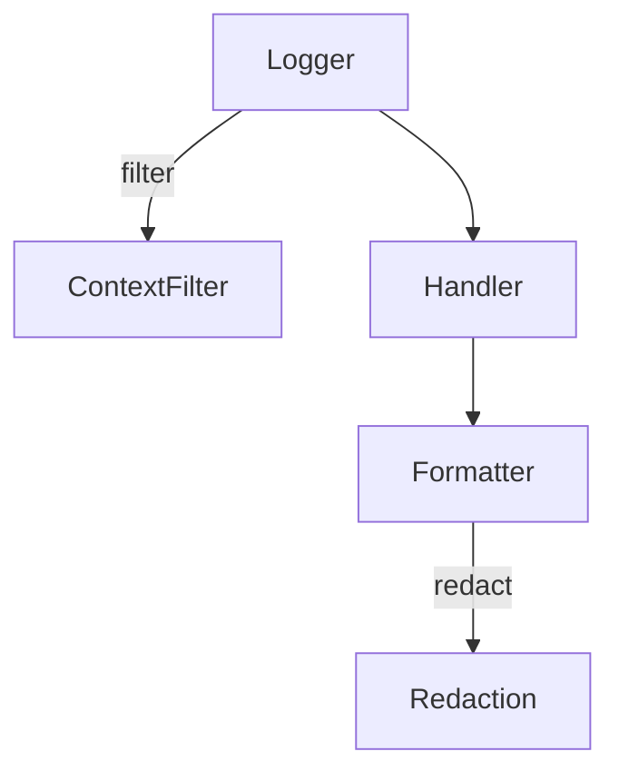

# apiconfig.utils.logging

Logging helpers used across **apiconfig**. This package bundles custom
formatters, context filters and convenience functions for setting up redacted
logging output.

## Contents
- `filters.py` – thread-local `ContextFilter` and helper functions for log context.
- `handlers.py` – `ConsoleHandler` and `RedactingStreamHandler` wrappers around `logging.StreamHandler`.
- `formatters/` – specialised formatters like `DetailedFormatter` and `RedactingFormatter`.
- `setup.py` – `setup_logging` function to configure the library's logger.
- `__init__.py` – exports the common classes and helpers.

## Example
```python
import logging
from apiconfig.utils.logging import setup_logging

setup_logging(level="INFO")
logger = logging.getLogger("apiconfig")
logger.info("configured")
```

## Key classes and functions
| Name | Description |
| ---- | ----------- |
| `ContextFilter` | Injects request or user context into log records via thread-local storage. |
| `DetailedFormatter` | Formats log messages with extra location information. |
| `RedactingFormatter` | Strips sensitive data using the redaction utilities. |
| `setup_logging` | Convenience function to configure handlers and formatters. |

### Design
The components follow a compositional approach: formatters delegate redaction to
`apiconfig.utils.redaction` and `setup_logging` wires up handlers with chosen
formatters. Context injection is optional via the filter.



## Tests
Run the logging-related unit tests:
```bash
python -m pip install -e .
python -m pip install pytest pytest-xdist
pytest tests/unit/utils/logging -q
```

## Status
Stable – provides common logging setup for the library.
