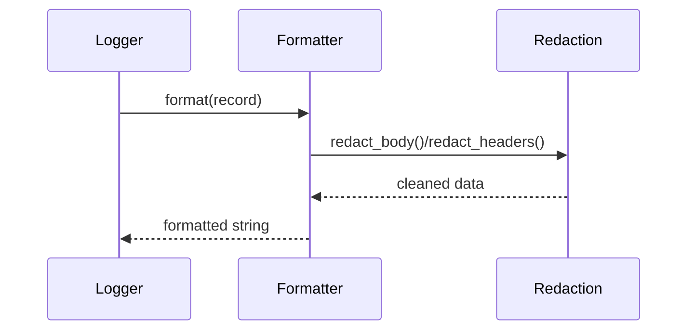

# apiconfig.utils.logging.formatters

Custom logging formatters used throughout **apiconfig**. These formatters extend
Python's built in `logging.Formatter` to provide rich log output and automatic
redaction of sensitive data. They are designed to be drop-in replacements for
standard formatters so applications can adopt them without major changes.

## Contents
- `detailed.py` – `DetailedFormatter` adds timestamps, level names, logger names
  and file/line information with smart handling of multiline messages and stack
  traces.
- `redacting.py` – `RedactingFormatter` sanitises log messages and headers by
  delegating to the utilities in `apiconfig.utils.redaction`.
- `__init__.py` – re-exports the formatters along with helper redaction
  functions for convenience.

## Usage
```python
import logging
from apiconfig.utils.logging.formatters import DetailedFormatter, RedactingFormatter

handler = logging.StreamHandler()
handler.setFormatter(DetailedFormatter())
logger = logging.getLogger("apiconfig")
logger.addHandler(handler)
logger.info("Configuration loaded")

secure_handler = logging.StreamHandler()
secure_handler.setFormatter(RedactingFormatter())
logger.addHandler(secure_handler)
logger.warning({"token": "secret", "msg": "unauthorized"})
```

## Key classes
| Class | Description |
| ----- | ----------- |
| `DetailedFormatter` | Formats log records with file and line info and indents multiline messages, exceptions and stack traces. |
| `RedactingFormatter` | Redacts sensitive values in messages and HTTP headers using the redaction utilities. |

### Design pattern
`RedactingFormatter` follows the **Strategy** pattern. It composes the
`redact_body` and `redact_headers` functions and can be customised with
alternative patterns and sets, keeping the formatting logic separate from the
redaction strategy.

## Diagram


## Tests
Install dependencies and run the formatter tests:
```bash
python -m pip install -e .
python -m pip install pytest pytest-xdist
pytest tests/unit/utils/logging/formatters -q
```

## Status
Stable – widely used by other modules for consistent logging behaviour.
