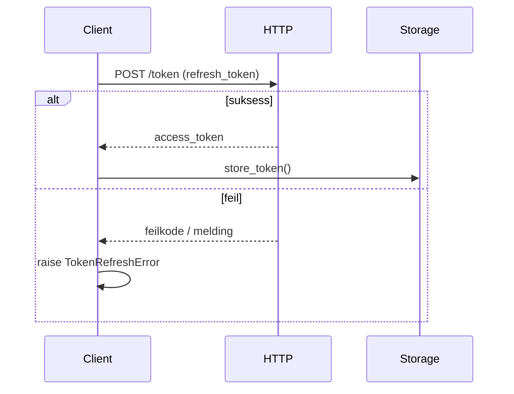

# apiconfig.auth.token

Utilities for managing OAuth2 tokens in **apiconfig**. This module handles token refresh logic and defines a simple token storage interface.

## Innhold

- `refresh.py` – funksjoner for å oppdatere OAuth2-access tokens.
- `storage.py` – `TokenStorage`-grensesnitt og `InMemoryTokenStorage`-implementasjon.
- `__init__.py` – eksporterer `refresh_oauth2_token` og lagringsklasser.

## Eksempel på bruk

```python
from apiconfig.auth.token import refresh_oauth2_token, InMemoryTokenStorage
import httpx

# HTTP-klienten brukes av refresh-funksjonen
client = httpx.Client(timeout=5.0)

# Hent nytt tilgangstoken med et refresh token
new_tokens = refresh_oauth2_token(
    refresh_token="abc123",
    token_url="https://auth.example.com/token",
    client_id="my-client",
    client_secret="s3cret",
    http_client=client,
)

storage = InMemoryTokenStorage()
storage.store_token("default", new_tokens)
```

## Nøkkelklasser og funksjoner

| Navn | Beskrivelse |
| ---- | ----------- |
| `TokenStorage` | Abstrakt baseklasse som definerer `store_token`, `retrieve_token` og `delete_token`. |
| `InMemoryTokenStorage` | Enkel implementasjon som lagrer tokens i en intern ordbok. Egnet for testing. |
| `refresh_oauth2_token` | Utfører selve token-refresh-operasjonen. Håndterer timeout, HTTP-feil, JSON-dekoding og retry-logikk. |

### Designmønster

`TokenStorage` følger strategimønsteret: ulike lagringsmetoder kan implementeres og benyttes om hverandre.

## Sekvensdiagram



## Testinstruksjoner

Installer pakkene og kjør unit-testene for denne modulen:

```bash
python -m pip install -e .
python -m pip install pytest pytest-xdist
pytest tests/unit/auth/token -q
```

## Status

Modulen anses som **stabil** og brukes av andre deler av biblioteket.
