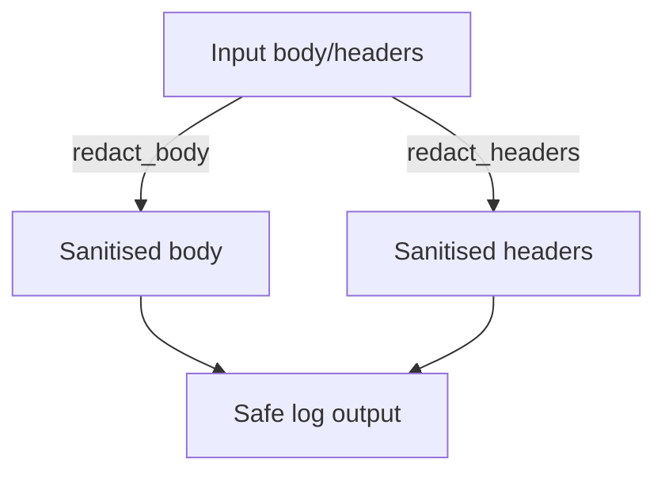

# apiconfig.utils.redaction

Utilities for scrubbing sensitive information from HTTP requests, responses and logs. The package centralises common redaction logic so that clients and logging helpers can easily avoid leaking secrets.

## Contents
- `body.py` – functions to redact JSON and form-encoded bodies.
- `headers.py` – utilities to remove secrets from HTTP headers and cookies.
- `__init__.py` – re-exports constants and helpers for convenient importing.

## Usage
```python
from apiconfig.utils.redaction import redact_body, redact_headers

body = {"token": "secret", "data": "ok"}
print(redact_body(body))  # {'token': '[REDACTED]', 'data': 'ok'}

headers = {"Authorization": "Bearer secret-token", "Content-Type": "json"}
print(redact_headers(headers))
```

## Key Functions
- `redact_body(body, content_type=None, sensitive_keys_pattern=..., sensitive_value_pattern=None)` – recursively strips values from dictionaries, JSON strings or form bodies.
- `redact_headers(headers, sensitive_keys=DEFAULT_SENSITIVE_HEADERS, ...)` – redacts header values and cookies based on configurable sets or regex patterns.

### Constants
- `DEFAULT_SENSITIVE_KEYS_PATTERN` – matches common sensitive keys such as `password`, `token` and `secret`.
- `DEFAULT_SENSITIVE_HEADERS`/`DEFAULT_SENSITIVE_HEADER_PREFIXES` – default header names and prefixes considered sensitive.
- `REDACTED_VALUE` and `REDACTED_BODY_PLACEHOLDER` – placeholders used when redacting.

## Design
Redaction utilities follow a functional style. `redact_body` and `redact_headers` are pure functions that operate on the provided data. The logging formatter modules reuse these helpers instead of implementing redaction logic themselves.



## Testing
Run unit tests with coverage:
```bash
pytest --cov=apiconfig --cov-report=html
```

## Status
Stable – used internally for logging and HTTP utilities.
