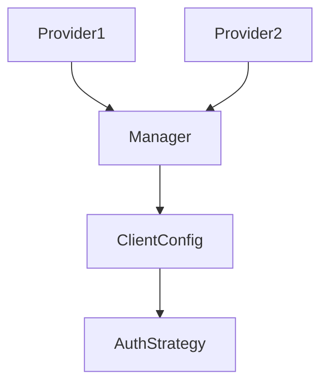

# apiconfig

Python library for building API clients with flexible configuration and pluggable
authentication. This package exposes the public API used by applications while
internal subpackages provide the implementation details.

## Contents
- `auth/` – authentication framework and built‑in strategies.
- `config/` – `ClientConfig` class and configuration providers.
- `exceptions/` – structured error hierarchy for configuration and HTTP issues.
- `testing/` – helpers and fixtures for unit and integration tests.
- `utils/` – assorted utilities such as logging setup and URL helpers.
- `__init__.py` – re‑exports common classes and determines the package version.

## Quick example
```python
from apiconfig import ClientConfig, ApiKeyAuth

config = ClientConfig(
    hostname="api.example.com",
    auth_strategy=ApiKeyAuth(api_key="key", header_name="X-API-Key"),
)
print(config.base_url)
```

## Key components
| Component | Description |
| --------- | ----------- |
| `ClientConfig` | Holds API connection settings like base URL, timeouts and authentication. |
| `AuthStrategy` and friends | Base class and built‑in strategies for headers or token handling. |
| `ConfigManager` | Loads and merges configuration from providers. |
| `EnvProvider` / `FileProvider` / `MemoryProvider` | Sources for configuration data. |
| `APIConfigError` and subclasses | Domain specific exceptions for reporting failures. |

### Design
`apiconfig` is organised into small focused modules. Authentication strategies
implement the **Strategy** pattern while configuration providers can be combined
in any order via `ConfigManager`.



## Testing
Install dependencies and run the full test suite:
```bash
python -m pip install -e .
python -m pip install pytest pytest-httpserver pytest-xdist
pytest -q
```

## Status
Stable – actively maintained with high test coverage.
