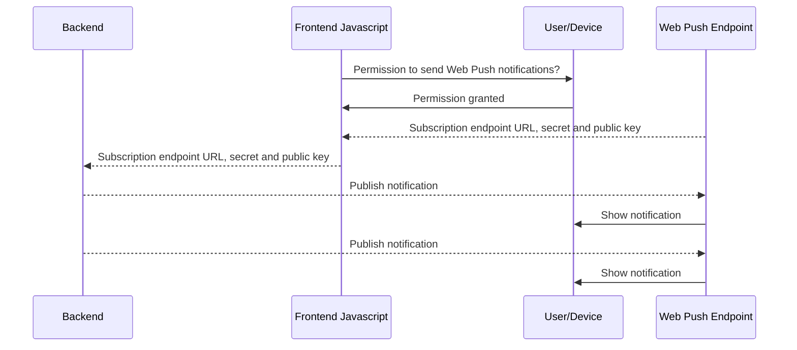
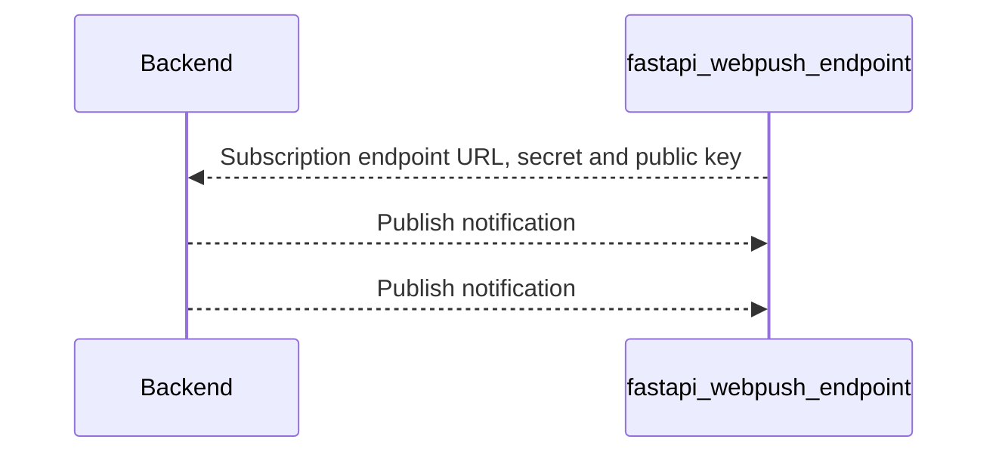

# 🫸💬📲⚡ FastAPI Web Push Endpoint
Subscribe to Web Push notifications and receive them in FastAPI.

Supports Python >= 3.11

## Installation 🛠️
```console
pip install fastapi_webpush_endpoint
```

To run examples, install with dependencies:
```console
pip install fastapi_webpush_endpoint[development]
```

## Intro to Web Push
Web Push allows an end user to give permission to a website, allowing it to send push notifications to the end user's device mediated by a Web Push Endpoint.

The flow is illustrated below. Javascript code triggers an "Allow notifications" dialogue which the user accepts. As a result, a Web Push Endpoint operated by the end user's web browser vendor is provided. Javascsript code can share the endpoint with the website backend. The website backend can then publish notifications to the endpoint and these will be delivered to the end user's device.


## What `fastapi_webpush_endpoint` does
`fastapi_webpush_endpoint` implements a Web Push Endpoint that backends can send notifications to. The flow is illustrated below. A `WebPushSubscription` object created by `fastapi_webpush_endpoint` is sent to the backend via HTTP request (typically `POST` method). The backend publishes notifications to the endpoint just as it would if it were a "real" service passing messages on to an end user device.


## Examples
See `examples/` directory for an example using either the [`pywebpush`](https://github.com/web-push-libs/pywebpush) or the [`webpush`](https://github.com/delvinru/webpush-py) library. There's also `endpoint_example.py` that only showcases the endpoint.

## What can I do with this?
* Integration tests of Web Push backends
* Use Web Push notifications as a regular webhook in downstream web services

## Foundations
* [FastAPI](https://github.com/tiangolo/fastapi)
* [Pydantic](https://github.com/pydantic/pydantic) for data validation
* [PyJWT](https://github.com/jpadilla/pyjwt) for validation of Web Push header JWT
* [http_ece](https://github.com/web-push-libs/encrypted-content-encoding) for decryption of Web Push message content