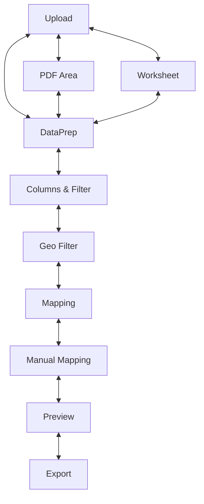

# Geo-Importer

Geo‑Importer is a Qt application that guides you through turning raw tables into
clean geographic data. It targets **Python 3.13** and ships a classic
`src/` layout together with unit tests and MkDocs documentation.

The program is centred around a wizard that walks through several steps:

1. **Upload** – load an Excel, CSV or PDF file.
2. **PDF Area** – for PDFs, choose the table region to extract.
3. **Worksheet** – for Excel, pick the sheet to process.
4. **DataPrep** – tidy up the table (skip header rows, delete cells, etc.).
5. **Columns & Filter** – select relevant columns and optionally apply a
   Pandas query expression to filter rows.
6. **Geo Filter** – load a reference GeoCSV (e.g. NUTS/LAU) and optionally
   filter it as well.
7. **Mapping** – automatically map statistics to geographic rows using a set of
   configurable matchers (prefix, regex, fuzzy, unique value).
8. **Manual Mapping** – review unmatched rows and fix them manually.
9. **Preview** – inspect the result on an interactive Folium map.
10. **Export** – save the final dataset as CSV or GeoJSON.



A quasi‑singleton `DataStore` object keeps all intermediate DataFrames so that
the views can share data without passing objects around. The core logic lives in
`src/core` and the individual Qt windows are under `src/views`.

## Project layout

```text
geo-importer/
├── src/               # Application packages
│   ├── core/          # Workflow logic, constants and the DataStore
│   ├── views/         # Qt based UI components for each wizard step
│   ├── mapper/        # Matching widgets and algorithms
│   ├── models/        # Minimal Qt models
│   ├── geodata/       # Sample geographic reference data (NUTS, LAU …)
│   └── main.py        # Application entry point
├── data/              # Example statistics tables for testing
├── static/            # Placeholder for generated assets
├── tests/             # Unit tests for core logic
└── docs/              # MkDocs site with API reference
```

## Quick start

The instructions below show three independent workflows.  Each one starts from

```bash
git clone https://github.com/frievoe97/geo-importer
cd geo-importer
```

To undo a workflow simply remove the virtual environment and build artefacts:

```bash
deactivate  # if the venv is active
rm -rf .venv dist build
```

### 1. Run the application locally

1. Create a Python 3.13 virtual environment and install the package:

   ```bash
   python3.13 -m venv .venv
   source .venv/bin/activate  # Windows: .venv\Scripts\activate
   pip install .
   ```

2. Launch the GUI directly from the repository:

   ```bash
   python main.py
   ```

3. Update `requirements.txt` after changing imports:

   ```bash
   python -m pipreqs.pipreqs . --force --ignore geo_importer,.venv
   ```

4. Undo: deactivate the environment and remove `.venv`.

### 2. Build and test the wheel locally

1. Set up a new environment and install build tools:

   ```bash
   python3.13 -m venv .venv
   source .venv/bin/activate
   pip install .
   python -m pip install --upgrade build
   ```

2. Build the distribution:

   ```bash
   python -m build
   ```

3. Install the wheel and run the application:

   ```bash
   pip install dist/geo_importer-*.whl
   geo-importer
   ```

4. Run the unit tests:

   ```bash
   pytest -v
   ```

5. Undo: remove `.venv` and the `dist/` and `build/` folders.

### 3. Publish to PyPI

1. Prepare the environment and build the wheel as above:

   ```bash
   python3.13 -m venv .venv
   source .venv/bin/activate
   python -m pip install --upgrade build twine
   python -m build
   ```

2. Upload the package:

   ```bash
   twine upload dist/*
   ```

3. Undo: remove `.venv` and the build artefacts.

The `data/` directory contains small example files and `src/geodata` ships
reference GeoCSV files that install automatically.

## Documentation

Run the helper script to generate API docs and serve them locally via MkDocs:

```bash
python generate_api_docs.py
mkdocs serve -f docs/mkdocs.yml
```

## Running tests

```bash
pytest -v
```

## Signal and Data Flow

Geo-Importer’s UI wiring is centralized in `MainWindow._wire_signals()` (see [`src/main.py`](src/main.py)). Each wizard step (a Qt window) emits a
custom signal when its task completes, and `MainWindow` listens for that signal to advance the workflow or hand off data.

### Signal Connections in `MainWindow._wire_signals()`

```python
# src/main.py, MainWindow._wire_signals()

# Navigation buttons and info
self.btn_back.clicked.connect(lambda: self._shift(-1))
self.btn_next.clicked.connect(lambda: self._shift(+1))
self.btn_info.clicked.connect(self._on_info_clicked)

# Wizard-step signals
self.pg_upload.uploadFinished.connect(self._on_uploaded)
self.pg_pdf.extractionReady.connect(self._on_pdf_ready)
self.pg_sheet.selectionReady.connect(self._on_sheet_ready)
self.pg_prep.prepReady.connect(self._on_prep_ready)
self.pg_filter.filterReady.connect(self._on_filter_ready)
self.pg_geo.filterReady.connect(self._on_geo_ready)
self.pg_mapping.mappingDone.connect(self._on_mapping_done)
self.pg_manual.manualMappingDone.connect(self._on_manual_ready)
self.pg_export.exportFinished.connect(lambda _: self._steps_done.update({Step.EXPORT: True}))
```

### Where Signals Are Defined

Each window class declares its “ready” signal:

```python
# src/views/dataprep/dataprep_window.py

class CleanDataView(QMainWindow, Ui_DataPrepWindow):
    """Cleans tabular data before mapping."""
    prepReady = Signal(pd.DataFrame)  # emitted when user confirms prep is done
    ...
```

Other windows follow the same pattern:

| Window                  | Signal                         | Payload / Purpose                                             |
|-------------------------|--------------------------------|---------------------------------------------------------------|
| **FileLoadView**        | `uploadFinished(str)`          | File path once upload completes                               |
| **PdfAreaView**         | `extractionReady(dict)`        | `{ "df": DataFrame }` extracted from selected PDF area        |
| **SheetSelectView**     | `selectionReady(dict)`         | `{ "df": DataFrame }` chosen sheet                            |
| **CleanDataView**       | `prepReady(DataFrame)`         | Cleaned DataFrame                                             |
| **ColumnFilterView**    | `filterReady(dict)`            | `{ "df_filtered": DataFrame, "selected_columns": List[str] }` |
| **GeoFilterView**       | `filterReady(dict)`            | Same as ColumnFilterView plus geo-metadata                    |
| **AutoMapView**         | `mappingDone(DataFrame)`       | DataFrame of automatically matched rows                       |
| **ManualMapView**       | `manualMappingDone(DataFrame)` | DataFrame after manual corrections                            |
| **MapPreviewView**      | `renderingFinished()`          | No payload; fires once Folium map is fully rendered           |
| **ExportView**          | `exportFinished(str)`          | Path to the generated ZIP archive                             |

### Emitting a Signal

Here’s how `CleanDataView` emits its signal once the user clicks “Next” (or when the window closes):

```python
# src/views/dataprep/dataprep_window.py

def emit_data(self) -> None:
    """Convert table widget contents to DataFrame and emit prepReady."""
    df = self._logic.convert_table_to_dataframe(
        get_table_data(self.tableWidget),
        self.tableWidget.columnCount()
    )
    self.prepReady.emit(df)


# Called automatically before closing:
def closeEvent(self, event) -> None:
    self.emit_data()
    super().closeEvent(event)
```

### High-Level Workflow

1. **Upload**

    * `FileLoadView` → `uploadFinished(path)` → `MainWindow._on_uploaded`
    * Decides next steps, stores path in `DataStore`.

2. **Extraction / Sheet Selection**

    * **PDF**: `PdfAreaView` → `extractionReady({"df": ...})` → `_on_pdf_ready`
    * **Excel**: `SheetSelectView` → `selectionReady({"df": ...})` → `_on_sheet_ready`
    * Both handlers call `CleanDataView.load_dataframe(df)`.

3. **Data Preparation**

    * User edits table → window emits `prepReady(df)` → `_on_prep_ready`
    * Handler passes the cleaned DataFrame to `ColumnFilterView`.

4. **Filtering**

    * `ColumnFilterView` → `filterReady({...})` → `_on_filter_ready`
    * Stores filtered DataFrame & selected columns in `DataStore`.

5. **Geo-Filtering**

    * `GeoFilterView` → `filterReady({...})` → `_on_geo_ready`
    * Initializes `AutoMapView` with user and geo DataFrames.

6. **Automatic Mapping**

    * `AutoMapView` → `mappingDone(df)` → `_on_mapping_done`
    * Stores results in `DataStore`.

7. **Manual Mapping**

    * `ManualMapView` → `manualMappingDone(df)` → `_on_manual_ready`.

8. **Preview**

    * `MapPreviewView` → `renderingFinished()` → transitions to Preview.

9. **Export**

    * `ExportView` → `exportFinished(path)` → marks export complete.

Throughout, a **quasi-singleton** [`DataStore`](src/core/data_store.py) holds all intermediate DataFrames so that views remain decoupled and no large
objects are passed directly between windows.

## License

Geo‑Importer is distributed under the terms of the MIT license. See
[LICENSE](LICENSE) for details.
