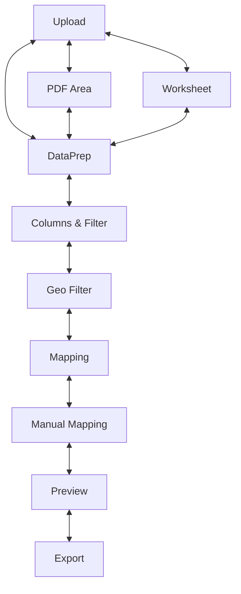

# Geo-Importer

Geo‑Importer is a Qt-based application that helps you convert raw tabular data into geographic datasets. It targets **Python 3.12+** and follows a conventional `src/` layout with unit tests and MkDocs documentation.

The workflow is implemented as a multi-step wizard:

1. **Upload** – load Excel, CSV or PDF files
2. **PDF Area** – select table regions inside PDFs
3. **Worksheet** – choose an Excel sheet to process
4. **DataPrep** – clean up the table (skip rows, delete cells, etc.)
5. **Columns & Filter** – pick relevant columns and apply optional Pandas filters
6. **Geo Filter** – load reference GeoCSV files (e.g. NUTS/LAU) and filter them
7. **Mapping** – automatically match statistics to geographic rows using several strategies
8. **Manual Mapping** – resolve unmatched rows manually
9. **Preview** – inspect the final dataset on an interactive Folium map
10. **Export** – save the result as CSV or GeoJSON



A shared `DataStore` object holds intermediate DataFrames so windows remain decoupled. Core logic lives in `src/core` and the Qt views are under `src/views`.

## Project layout

```text
geo-importer/
├── src/               # Application packages
│   ├── core/          # Workflow logic, constants and the DataStore
│   ├── views/         # Qt based UI components for each wizard step
│   ├── mapper/        # Matching widgets and algorithms
│   ├── models/        # Minimal Qt models
│   ├── geodata/       # Sample geographic reference data (NUTS, LAU …)
│   └── main.py        # Application entry point
├── data/              # Example statistics tables for testing
├── static/            # Placeholder for generated assets
├── tests/             # Unit tests for core logic
└── docs/              # MkDocs site with API reference
```

## Quick start

The instructions below show three independent workflows.  Each one starts from

```bash
git clone https://github.com/frievoe97/geo-importer
cd geo-importer
```

To undo a workflow simply remove the virtual environment and build artefacts:

```bash
deactivate  # if the venv is active
rm -rf .venv dist build geo_importer.egg-info
```

### 1. Run the application locally

1. Create a Python 3.12+ virtual environment and install the package:

```bash
python3.12 -m venv .venv
source .venv/bin/activate  # Windows: .venv\Scripts\activate
pip install .
```

2. Launch the GUI directly from the repository:

```bash
python main.py
```

3. Run the unit tests:

```bash
pytest -v
```

4. Undo: deactivate the environment and remove `.venv` and the `geo_importer.egg-info` directory.

### 2. Build and test the wheel locally

1. Set up a new environment and install build tools:

```bash
python3.12 -m venv .venv
source .venv/bin/activate
pip install .
python -m pip install --upgrade build
```

2. Build the distribution:

```bash
python -m build
```

3. Install the wheel and run the application:

```bash
pip install dist/geo_importer-*.whl
geo-importer
```

4. Run the unit tests:

```bash
pytest -v
```

5. Undo: remove `.venv` and the `dist/` and `build/` folders.

### 3. Publish to PyPI

1. Prepare the environment and build the wheel as above:

```bash
python3.12 -m venv .venv
source .venv/bin/activate
python -m pip install --upgrade build twine
python -m build
```

2. Upload the package:

```bash
twine upload dist/*
```

3. Undo: remove `.venv` and the build artefacts.

The `data/` directory contains small example files and `src/geodata` ships
reference GeoCSV files that install automatically.

### Automated publishing via GitHub Actions

1. Add your PyPI API key as the `PYPI_API_TOKEN` secret in the GitHub repository
2. Bump the version in `pyproject.toml` and `src/main.py` using the helper script:

```bash
scripts/bump_version.py 0.1.0b16
```

3. Commit the changes on your `release` branch and create a tag that starts with `v`:

```bash
git tag v0.1.0b16
git push origin release --tags
```

Pushing the tag triggers `.github/workflows/pypi.yml`. It runs the test suite,
builds the wheel and uploads the package to PyPI automatically.

## Documentation

Run the helper script to generate API docs and serve them locally via MkDocs:

```bash
python generate_api_docs.py
mkdocs serve -f docs/mkdocs.yml
```

### Publishing on GitHub Pages

Documentation is published automatically when a release tag is pushed. After
bumping the version and tagging a release on the `release` branch, the
`pages.yml` workflow builds the docs with [mike](https://github.com/jimporter/mike)
so older versions remain available. GitHub Pages must be enabled in the
repository settings with **GitHub Actions** as the source. Once the workflow
finishes the site is available at `https://<username>.github.io/geo-importer`.

## Running tests

```bash
pytest -v
```

## Signal and Data Flow

Signals connect each wizard step with the main window:

- `FileLoadView.uploadFinished` → `_on_uploaded`
- `PdfAreaView.extractionReady` → `_on_pdf_ready`
- `SheetSelectView.selectionReady` → `_on_sheet_ready`
- `CleanDataView.prepReady` → `_on_prep_ready`
- `ColumnFilterView.filterReady` → `_on_filter_ready`
- `GeoFilterView.filterReady` → `_on_geo_ready`
- `AutoMapView.mappingDone` → `_on_mapping_done`
- `ManualMapView.manualMappingDone` → `_on_manual_ready`
- `ExportView.exportFinished` → marks export as complete

Each view emits a custom Qt signal once its task finishes. `MainWindow` listens to these signals, stores the results in `DataStore`, and advances the workflow accordingly.

## License

Geo‑Importer is distributed under the terms of the MIT license. See
[LICENSE](LICENSE) for details.
