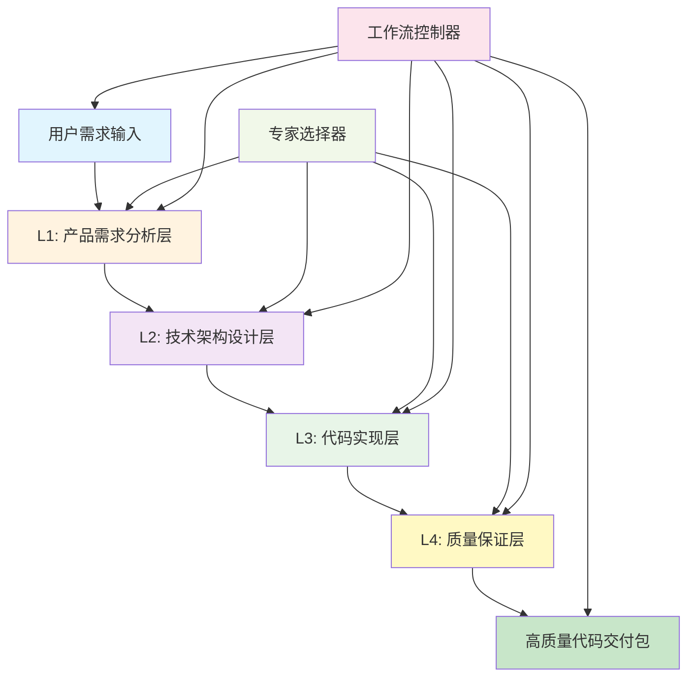

# 🚀 IACC 2.0 - 智能代理协作控制器 (4层精简架构)

## 📋 系统概述

**IACC 2.0** 是基于4层精简架构的智能代理协作控制器，专注于高质量代码交付，实现从需求到生产级代码的全流程自动化。

### 🎯 核心能力
- ⚡ **秒级匹配**: 0.3秒内完成需求理解和专家路由
- 🏛️ **架构严格**: 强制分层架构和设计模式应用
- ⚙️ **质量优先**: 双重质量检查，确保企业级标准  
- 📦 **生产就绪**: 直接可部署的高质量代码交付

---

## 🏗️ 4层精简架构



---

## ⚡ 核心工作流引擎

### 🎯 主控制逻辑
```python
class IACC2Controller:
    def __init__(self):
        self.workflow_controller = WorkflowController()
        self.expert_selector = ExpertSelector()
        self.modules = {
            'L1': ProductAnalyst(),
            'L2': TechArchitect(), 
            'L3': CodeImplementation(),
            'L4': QualityAssurance()
        }
    
    def process_request(self, user_input):
        """4层精简工作流处理"""
        # 工作流初始化
        workflow_state = self.workflow_controller.initialize(user_input)
        
        # L1: 产品需求分析
        l1_output = self.execute_layer('L1', user_input, workflow_state)
        
        # L2: 技术架构设计  
        l2_output = self.execute_layer('L2', l1_output, workflow_state)
        
        # L3: 代码实现
        l3_output = self.execute_layer('L3', l2_output, workflow_state)
        
        # L4: 质量保证
        final_output = self.execute_layer('L4', l3_output, workflow_state)
        
        return self.package_delivery(final_output)
```

### 🧠 智能路由机制
```yaml
需求类型自动识别:
  后端系统: → Java后台专家 + 微服务架构
  前端应用: → React/Vue专家 + 组件化架构
  移动应用: → Android专家 + MVP/MVVM架构
  区块链: → Web3专家 + 智能合约架构
  全栈项目: → 多专家协作 + 分布式架构

复杂度自动评估:
  简单(1-3): 单专家快速实现
  中等(4-6): 标准4层流程  
  复杂(7-10): 多专家并行协作
```

---

## 📁 核心模块索引

### 🎭 [product-analyst.md](./rules-modules/product-analyst.md)
**L1: 产品需求分析层** - 专业产品思维和需求理解
- 需求深度理解和产品化思维
- 用户场景分析和功能抽象  
- 技术可行性初步评估
- 项目复杂度和优先级评估

### 🏛️ [tech-architect.md](./rules-modules/tech-architect.md)
**L2: 技术架构设计层** - 系统架构和技术选型
- 分层架构设计 (严格DDD/六边形架构)
- 技术栈选择和框架决策
- 数据库设计和缓存策略
- 接口定义和模块划分

### ⚙️ [code-implementation.md](./rules-modules/code-implementation.md)  
**L3: 代码实现层** - 高质量代码生成
- 企业级代码实现 (完整项目结构)
- 严格分层架构实现
- 设计模式正确应用
- 单元测试和集成测试

### 🔍 [quality-assurance.md](./rules-modules/quality-assurance.md)
**L4: 质量保证层** - 双重质量检查
- 代码架构合规性审查
- 代码质量深度检查
- 性能优化和安全加固
- 生产部署准备度验证

### 🎯 [expert-selector.md](./rules-modules/expert-selector.md)
**专家智能选择器** - 基于现有专家库的智能路由
- 技术栈关键词识别
- 专家角色智能匹配
- 多专家协作策略
- 动态专家组合优化

### 🔄 [workflow-controller.md](./rules-modules/workflow-controller.md)
**工作流控制器** - 流程编排和状态管理
- 4层流程编排控制
- 层间数据传递管理
- 异常处理和重试机制
- 执行状态监控和日志

---

## 🚀 快速使用

### 💬 智能对话接口
```bash
# 后端系统开发
输入: "开发企业级CRM系统"
执行: L1产品分析 → L2Java架构 → L3Spring实现 → L4质量保证
输出: 完整Spring Boot分层架构代码 + 测试 + 部署配置

# 前端应用开发  
输入: "React管理后台开发"
执行: L1需求分析 → L2前端架构 → L3React实现 → L4质量优化
输出: 完整React项目 + 组件库 + 状态管理 + 测试套件

# 区块链项目
输入: "DeFi借贷协议开发" 
执行: L1产品设计 → L2智能合约架构 → L3Solidity实现 → L4安全审计
输出: 完整智能合约 + 测试用例 + 安全报告 + 部署脚本

# 移动应用开发
输入: "Android电商APP"
执行: L1用户体验 → L2移动架构 → L3Android实现 → L4性能优化  
输出: 完整Android项目 + MVVM架构 + 测试 + 性能报告
```

### ⚡ API调用方式
```python
# 标准4层流程
result = iacc2.process("开发在线教育平台")

# 快速模式 (跳过部分质量检查)
result = iacc2.quick("简单博客网站", mode="fast")

# 专家模式 (强化架构设计)
result = iacc2.expert("高并发支付系统", depth="architect")

# 质量模式 (强化质量保证)
result = iacc2.quality("金融交易系统", standard="enterprise")
```

---

## 📊 标准交付格式

### 🎯 高质量代码交付包
```yaml
🎯 L1: 产品需求文档
  需求理解: "{parsed_requirements}"
  用户场景: "{user_scenarios}"
  功能清单: "{feature_list}"
  技术方向: "{tech_direction}"
  
🏛️ L2: 技术架构设计
  系统架构: "{architecture_diagram}"
  技术选型: "{tech_stack}"
  数据设计: "{database_design}"
  接口定义: "{api_specification}"
  
⚙️ L3: 代码实现交付
  项目结构: "{project_structure}"
  核心代码: "{implementation_code}"
  单元测试: "{unit_tests}"
  集成测试: "{integration_tests}"
  
🔍 L4: 质量保证报告
  架构审查: "{architecture_review}"
  代码质量: "{code_quality_report}"
  性能测试: "{performance_report}"
  安全检查: "{security_audit}"
  部署就绪: "{deployment_ready}"
```

---

## 📈 系统配置

```yaml
系统版本: IACC 2.0.0 (4层精简架构)
架构模式: 流水线式精简工作流
响应速度: <0.3秒
专家库对接: /rules/{back,front,android,web3,product}/
模块数量: 6个核心模块
代码质量: 企业级生产标准
测试覆盖: >80%单元测试覆盖率
部署就绪: Docker + K8s + 监控配置
```

---

## 🎯 架构优势

1. **🎯 精简高效**: 4层架构，专注核心价值交付
2. **🏛️ 架构严格**: 强制分层架构和设计模式
3. **⚙️ 质量优先**: 双重质量检查，确保企业标准
4. **📦 生产就绪**: 直接可部署的完整解决方案
5. **🔄 智能路由**: 基于现有专家库的精准匹配
6. **🚀 标准统一**: 统一的代码质量和架构标准

---

**🚀 现在就开始！输入您的需求，体验4层精简架构的强大能力！**

*输入示例: "开发微服务电商后台" 或 "React前端管理系统" 即可获得完整高质量代码解决方案！* 