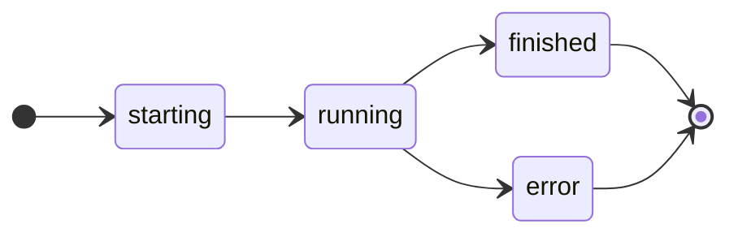

# Execution Lifecycle

A flow launched with `Launch` response runs through the following states:



The `Launch` requires the following arguments:

* request (`fastAPI.Request`)
* entry_point (`str` or `callable`)
* inputs (`Any`)

**Example:**

The following example launches a CrewAI `Crew` in `hymn.app` with `core.Launch`.

```python
@app.enter(
        path="/", 
        model=hymn_model,
        summary="Hymn Creator",
        description="This agent creates a short hymn about a given topic of your choice using openai and crewai.",
        version="1.0.1",
        author="m.rau@house-of-communication.com",
        tags=["Test", "CrewAi"]
    )
async def enter(request: fastapi.Request, inputs: dict):
    topic = inputs.get("topic", "").strip()
    if not topic:
        raise core.InputsError(topic="Please give me a topic.")
    return core.Launch(request, "hymn.app:crew", inputs=inputs)
```

# Events

In the lifetime of a flow execution the following events are tracked.

| event  | description                               | method            | screen               |
| ------ | ----------------------------------------- | ----------------- | -------------------- |
| meta   | flow metadata and entry point information | (internal)        | n/a                  |
| inputs | user input data                           | (internal)        | Input                |
| agent  | agent information                         | agent meta data   | n/a                  |
| debug  | debug message                             | debug             | Log                  |
| stdout | stdout information                        | print, sys.stdout | Log                  |
| stderr | stderr information                        | sys.stderr        | Log                  |
| status | flow status change                        | (internal)        | n/a                  |
| error  | error information                         | (internal)        | Output/Reasoning/Log |
| action | action information                        | tool result       | Reasoning            |
| result | task result information                   | result            | Reasoning            |
| final  | final result information                  | final result      | Ouput                |

kodosumi provides a couple of helper methods to simplify emitting events:

* `tracer.debug(message: str)` - emit debug plain text message
* `tracer.result(message: Any)` - emit result object
* `tracer.action(message: Any)` - emit action result object
* `tracer.markdown(message: str)` - emit markdown result string
* `tracer.html(message: str)` - emit HTML result string
* `tracer.text(message: str)` - emit plain text result string

The corresponding synchronous methods are

* `tracer.debug_sync(message: str)`
* `tracer.result_sync(message: Any)`
* `tracer.action_sync(message: Any)`
* `tracer.markdown_sync(message: str)`
* `tracer.html_sync(message: str)`
* `tracer.text_sync(message: str)`
