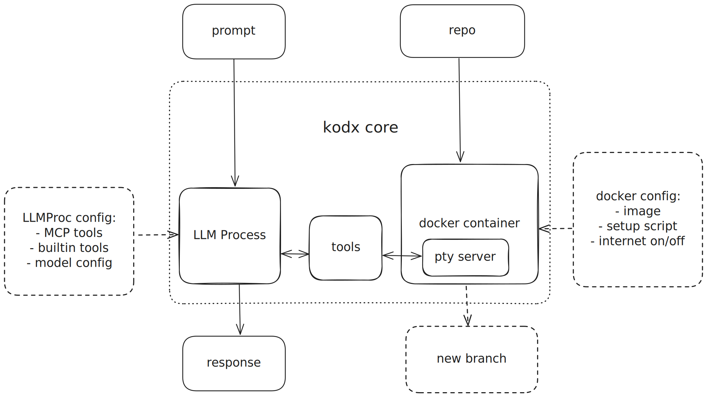

<h1 align="center">Kodx</h1>
<p align="center">Codex-inspired background agent that runs on your machine</p>




## Installation

```bash
uv pip install kodx
```

> [!IMPORTANT]
> Set up your API key:
> ```bash
> export ANTHROPIC_API_KEY="your-api-key-here"
> ```
> Kodx also requires Docker to be installed and running on your system.

## Quick Start: `kodx code`

```bash
# Fix a bug or implement a feature - kodx creates a git branch automatically
kodx code "fix the failing authentication tests"

# Work from a specific branch
kodx code "add rate limiting to the API" --base-ref feature/api-v2

# Debug with uncommitted changes included
kodx code "help me fix this error" --dirty
```

What happens:
1. **AI works in isolation** - Code is written and tested in a Docker container
2. **AI decides what to commit** - The AI makes explicit decisions about when and what to commit
3. **Git fetches committed changes** - Only changes the AI commits are retrieved
4. **Branch created if needed** - A new branch appears in your repo only if the AI made commits

## How Kodx Works

Kodx is built on a simple but powerful architecture:

### The Core: `kodx`
At its heart, Kodx provides a flexible command (`kodx`) that runs AI coding assistants in Docker containers. The AI interacts with code through a shell interface, keeping your system safe while enabling powerful automation.

```bash
# The core command gives you full control
kodx --prompt "Create a web server" --export-dir ./output
```

See [docs/kodx-core.md](docs/kodx-core.md) for advanced usage.

### Specialized Commands
Built on top of the core, Kodx provides two specialized commands:

- **`kodx code`** - Git-integrated workflow that automatically creates branches and commits
- **`kodx ask`** - Read-only code analysis that never modifies files

### Key Architecture
- **Container Isolation**: Each session runs in a fresh Docker container
- **Minimal Interface**: AI uses just 2 tools - shell interaction and session reset
- **Git Integration**: `kodx code` manages branches, commits, and exports automatically
- **Safety First**: Your working directory is never touched directly

## Additional Command: `kodx ask`

For code analysis without modifications, use `kodx ask`:

```bash
kodx ask "What does this project do?"
kodx ask "Find potential security issues" --cost-limit 5.0
```

Like `kodx code`, it's a thin wrapper around the core `kodx` command but configured for read-only analysis.

## Configuration and Customization

### `kodx init` - Project Setup

Initialize project-specific configurations:

```bash
kodx init
```

This creates default `.kodx/ask.yaml` and `.kodx/code.yaml` files that customize the behavior of the specialized commands while leveraging the core `kodx` infrastructure.

> [!TIP]
> Commit the `.kodx/` files in your git repo and customize the behavior of `kodx code`.

```yaml
# .kodx/code.yaml
model:
  name: claude-sonnet-4-20250514
  provider: anthropic
  max_iterations: 100

docker:
  image: node:18
  setup_script: |
    npm install -g typescript
    apt-get update && apt-get install -y git
  disable_network_after_setup: false

prompts:
  system: |
    You are a TypeScript development assistant.
    Use the provided tools to analyze and modify code.
```

> [!TIP]
> Kodx's YAML configuration is built on LLMProc, allowing you to easily extend it with MCP tools.
> - Learn more at [https://github.com/cccntu/llmproc](https://github.com/cccntu/llmproc)

## Documentation

- [Getting Started Guide](docs/quickstart.md)
- [`kodx` Core Documentation](docs/kodx-core.md)
- [`kodx code` Documentation](docs/kodx-code.md)
- [`kodx ask` Documentation](docs/kodx-ask.md)
- [Architecture & Internals](docs/architecture.md)
- [GitHub Actions Examples](docs/github-action-examples.md)

## License

Apache License 2.0

## Acknowledgements

Kodx is directly inspired by [ChatGPT Codex](https://openai.com/index/introducing-codex/). The tool design and pty-shell server design is copied from ChatGPT Codex.

## Related Projects

- [LLMProc](https://github.com/cccntu/llmproc) - Kodx is built on top of LLMProc, a LLM process management framework.
- [AIShell](https://github.com/cccntu/aishell) - AIShell is a transparent shell wrapper that provides clean context for AI.
