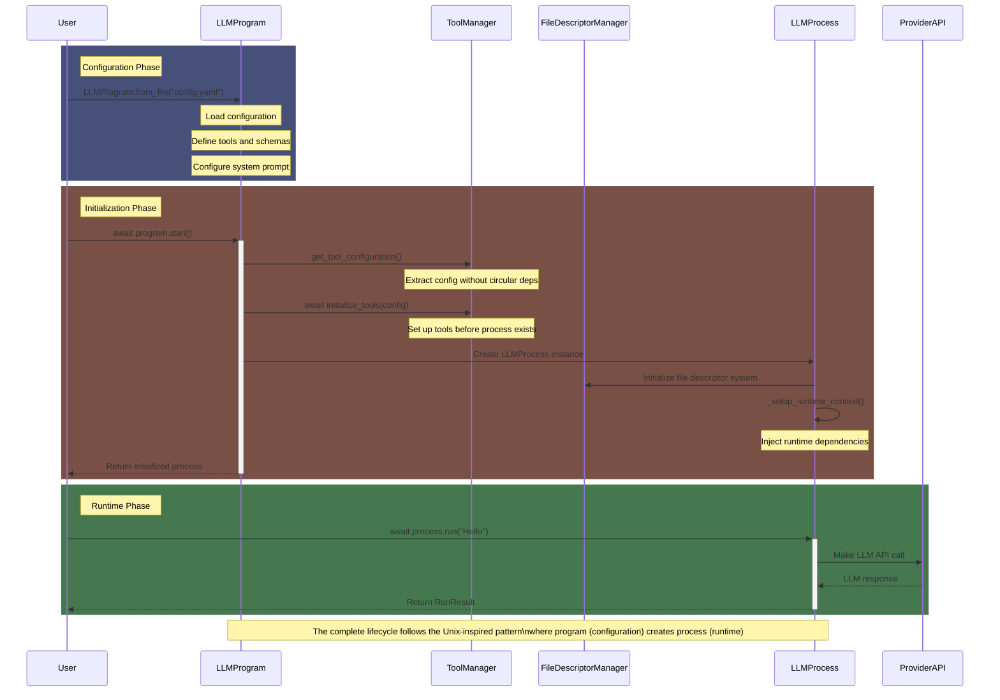
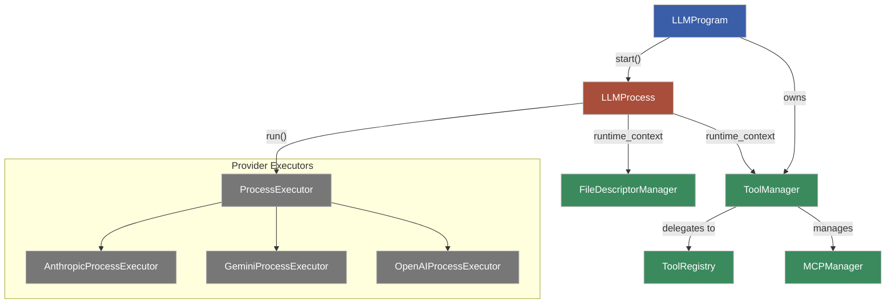
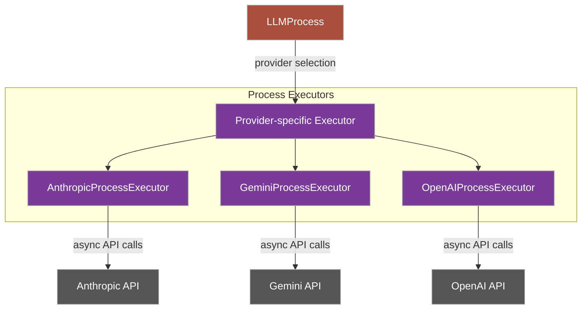

# Architecture Diagrams

## Unix-Inspired Program/Process Model

The llmproc library follows a Unix-inspired separation between Programs and Processes:

### Program-to-Process Lifecycle





### Key Components

- **LLMProgram**: Immutable configuration (like a Unix binary executable)
  - Contains model and provider configuration
  - Defines tools, system prompt, parameters
  - Compiled once and used to create runtime instances

- **LLMProcess**: Runtime instance created from a Program (like a Unix process)
  - Contains mutable state (conversation history)
  - Manages access to the LLM API
  - Provides runtime context for tools

- **ToolManager**: Central point for managing all tools
  - Handles registration, aliases, and execution of tools
  - Maintains list of enabled tools
  - Provides runtime context to tools

- **FileDescriptorManager**: Manages large content
  - Handles content that exceeds message size limits
  - Provides pagination and reference system
  - Integrates with tools that use file descriptors

- **ProcessExecutor**: Provider-specific implementations
  - Handle details of LLM API integration
  - Manage token counting and usage
  - Process tool calls in provider-specific formats

## Class Responsibilities

### Core Components

#### LLMProgram

- **Primary responsibility**: Define and validate an LLM configuration
- **Key properties**:
  - `model_name`: Name of the LLM model to use
  - `provider`: Provider of the model (anthropic, openai, vertex)
  - `system_prompt`: Base system prompt for the model
  - `parameters`: API parameters dictionary
  - `preload_files`: List of files to preload into context
  - `preload_relative_to`: Whether preload paths are relative to the program file or CWD
  - `linked_programs`: Dictionary of linked programs
  - `tool_manager`: Manager for all tool operations
  - `compiled`: Flag indicating if the program has been validated

- **Key methods**:
- `from_toml(path)`: Load configuration from TOML file
- `from_yaml(path)`: Load configuration from YAML file
  - `start()`: Create fully initialized LLMProcess instance (handles validation automatically)
  - `register_tools(tools)`: Configure available tools
  - `set_tool_aliases(aliases)`: Set user-friendly aliases
  - `configure_file_descriptor(enabled)`: Configure FD system
  - `get_tool_configuration()`: Extract config for tools initialization

#### LLMProcess

- **Primary responsibility**: Execute the LLM configuration and manage interactions
- **Key properties**:
  - `model_name`: Name of the LLM model
  - `provider`: Provider of the model
  - `state`: List containing conversation history
  - `tool_manager`: Manager for tool operations
  - `fd_manager`: File descriptor manager
  - `linked_programs`: Dictionary of linked program instances

- **Key methods**:
  - `run(user_input, max_iterations)`: Process user input
  - `call_tool(tool_name, **kwargs)`: Call a tool by name
  - `get_state()`: Return current conversation state
  - `reset_state(keep_system_prompt, keep_file_descriptors)`: Clear conversation history (⚠️ Experimental API)
  - `count_tokens()`: Calculate token usage
  - `get_last_message()`: Get most recent model response
  - `fork_process()`: Create a copy with the same state *(deprecated; use `_fork_process` or the fork tool)*

#### ToolManager

- **Primary responsibility**: Unified management of all tool types
- **Key properties**:
  - `runtime_registry`: Registry for tool definitions and handlers
  - `mcp_manager`: Manager for MCP server tools
  - `runtime_context`: Context for dependency injection

- **Key methods**:
  - `initialize_tools(config)`: Set up all tools
  - `register_system_tools(config)`: Register built-in tools
  - `process_function_tools()`: Process function-based tools
  - `add_function_tool(func)`: Add individual function tools
  - `register_aliases(aliases)`: Register user-friendly aliases
  - `call_tool(name, args, runtime_context)`: Execute a tool
  - `get_tool_schemas()`: Get tool definitions for LLM API
  - `register_tools(tools)`: Register tools for availability
  - `set_runtime_context(context)`: Set up runtime dependencies

#### FileDescriptorManager

- **Primary responsibility**: Handle large content that exceeds API limits
- **Key properties**:
  - `file_descriptors`: Dictionary of stored file descriptors
  - `default_page_size`: Characters per page for pagination
  - `max_direct_output_chars`: Threshold for creating FDs
  - `page_user_input`: Whether to page large user inputs
  - `enable_references`: Whether to handle references in output

- **Key methods**:
  - `create_fd_content(content, page_size)`: Create new file descriptor
  - `read_fd_content(fd_id, read_all, mode, start, count)`: Read content
  - `write_fd_to_file_content(fd_id, file_path, mode)`: Write to file
  - `handle_user_input(user_input)`: Process potentially large input
  - `process_references(message)`: Extract references from output
  - `create_fd_from_tool_result(content, tool_name)`: Create FD from tool

## Process Executor Architecture



The Process Executors are responsible for:

1. Translating LLMProcess state into provider-specific API calls
2. Handling tool execution in provider-specific formats
3. Managing token counting and API-specific features
4. Processing streaming responses (when supported)
5. Aggregating usage information for RunResult

# Class Reference

The following section provides detailed information about each class in the LLMProc library, including their methods, parameters, and return values.

## LLMProgram

The `LLMProgram` class represents a program configuration for an LLM, including model, provider, system prompt, and other settings.

### Class Methods

```python
@classmethod
def from_toml(cls, toml_path: Union[str, Path], include_linked: bool = True) -> "LLMProgram":
    """Load and compile a program from a TOML file."""

```

### Instance Methods

```python
async def start(self) -> "LLMProcess":
    """Create and fully initialize an LLMProcess from this program."""

def get_enriched_system_prompt(self, process_instance=None, include_env: bool = True) -> str:
    """Get the system prompt enriched with preloaded content and environment info."""
```

### Key Properties

- `model_name`: Name of the LLM model
- `provider`: Provider of the model (anthropic, openai, vertex)
- `system_prompt`: Base system prompt
- `api_params`: API parameters for the model
- `linked_programs`: Dictionary of linked programs
- `tools`: List of tool functions (or dict with aliases)
- `preload_files`: List of files to preload
- `preload_relative_to`: Whether preload paths are relative to the program file or CWD
- `base_dir`: Base directory for resolving paths
- `tool_manager`: Manager for all tool operations

## LLMProcess

The `LLMProcess` class represents a running instance of an LLM program, maintaining state and handling API interactions.

### Class Methods

```python
@classmethod
async def create(cls, program: "LLMProgram", linked_programs_instances: dict[str, "LLMProcess"] = None) -> "LLMProcess":
    """Create and fully initialize an LLMProcess asynchronously."""
```

### Instance Methods

```python
async def run(self, user_input: str, max_iterations: int = 10, callbacks: dict = None) -> "RunResult":
    """Run the LLM process with user input and return metrics."""

def get_last_message(self) -> str:
    """Get the most recent assistant message text."""

def reset_state(self, keep_system_prompt: bool = True, keep_file_descriptors: bool = True) -> None:
    """Reset the conversation state. ⚠️ Experimental API - may change in future versions."""

def get_state(self) -> list[dict[str, str]]:
    """Return the current conversation state."""

async def call_tool(self, tool_name: str, **kwargs) -> Any:
    """Call a tool by name with the given arguments."""
```

### Key Properties

- `program`: Reference to the LLMProgram
- `state`: List of conversation messages
- `tool_manager`: Manager for all tool operations
- `enriched_system_prompt`: System prompt with preloaded content
- `fd_manager`: File descriptor manager (if enabled)
- `linked_programs`: Dictionary of linked program instances

## RunResult

The `RunResult` class contains metrics and information about a process run.

### Methods

```python
def add_api_call(self, info: Dict[str, Any]) -> None:
    """Record information about an API call."""

def complete(self) -> "RunResult":
    """Mark the run as complete and calculate duration."""
```

### Properties

- `api_call_infos`: List of raw API response data
- `api_calls`: Number of API calls made
- `start_time`: When the run started
- `end_time`: When the run completed
- `duration_ms`: Duration of the run in milliseconds
- `usd_cost`: Estimated cost of the run in USD (Anthropic models only)

## ToolRegistry

The `ToolRegistry` class manages tool registration, access, and execution.

### Methods

```python
def register_tool(self, name: str, handler: ToolHandler, definition: ToolSchema) -> ToolSchema:
    """Register a tool with its handler and definition."""

def get_handler(self, name: str) -> ToolHandler:
    """Get a handler by tool name."""

def list_tools(self) -> List[str]:
    """List all registered tool names."""

def get_definitions(self) -> List[ToolSchema]:
    """Get all tool definitions for API calls."""

async def call_tool(self, name: str, args: Dict[str, Any]) -> Any:
    """Call a tool by name with the given arguments."""
```

### Properties

- `tool_definitions`: List of tool schemas
- `tool_handlers`: Dictionary mapping tool names to handlers
- `tool_aliases`: Dictionary mapping alias names to actual tool names

## AnthropicProcessExecutor

The `AnthropicProcessExecutor` class handles Anthropic-specific process execution.

### Methods

```python
async def run(self, process: 'Process', user_prompt: str, max_iterations: int = 10,
              callbacks: dict = None, run_result = None, is_tool_continuation: bool = False) -> "RunResult":
    """Execute a conversation with the Anthropic API."""

async def run_till_text_response(self, process, user_prompt, max_iterations: int = 10):
    """Run the process until a text response is generated."""
```

## System Tools

### spawn_tool

```python
@context_aware
async def spawn_tool(args: Dict[str, Any], runtime_context: Optional[Dict[str, Any]] = None) -> Dict[str, Any]:
    """Execute a query on a linked program.

    Args:
        args: Dictionary containing the tool arguments:
            - program_name: The name of the linked program to call
            - query: The query to send to the linked program
            - additional_preload_files: Optional list of file paths to preload
        runtime_context: Runtime context dictionary containing dependencies needed by the tool.
            Required keys: 'process' (LLMProcess instance with linked_programs)
    """
```

### fork_tool

```python
async def fork_tool(prompts: List[str], llm_process = None) -> Dict[str, Any]:
    """Fork the conversation into multiple processes."""
```

## Callback Definitions

```python
# Type definitions for callbacks
on_tool_start_callback = Callable[[str, Dict[str, Any]], None]  # (tool_name, args) -> None
on_tool_end_callback = Callable[[str, Any], None]  # (tool_name, result) -> None
on_response_callback = Callable[[str], None]  # (content) -> None

# Callback dictionary format
callbacks = {
    "on_tool_start": on_tool_start_callback,
    "on_tool_end": on_tool_end_callback,
    "on_response": on_response_callback
}
```

---
[← Back to Documentation Index](../index.md)
