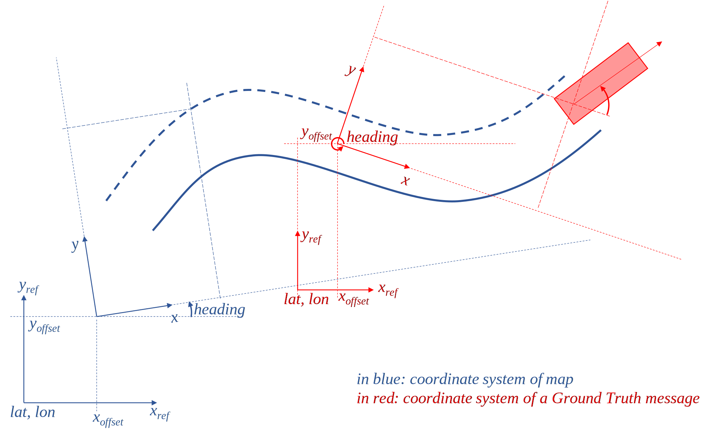
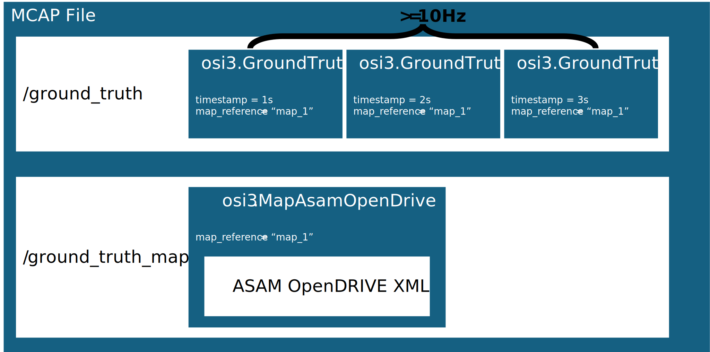

Scenario Source Data –  
Specification of Data Model and Format (OMEGA-PRIME)
===
Michael Schuldes, Clément Val, Carlo van Driesten

# Introduction

In the context of SYNERGIES, Scenario Source Data (SSD) corresponds to
the data that is provided to WP5 for scenario identification and
extraction. Such data can stem from multiple sources: in-traffic-vehicle
data collection, fixed or mobile (e.g., drones) roadside observations,
dynamic accident reconstruction, but also generative AI, traffic
simulation… WP5 itself will also develop multiple approaches to generate
scenarios from data. To facilitate interoperability between multiple
data sources and multiple scenarios’ creation approaches, a
standardization of Scenario Source Data needs to be defined, both in
terms of content and in terms of container, i.e., format.

The format itself is called OMEGA-PRIME. It relies on existing ASAM
standards, namely ASAM OpenDRIVE and ASAM Open Simulation Interface.
Those allow, respectively, to represent the infrastructure and traffic
participants’ type, trajectories, and state. The OMEGA-PRIME format also
specifies MCAP as the container in which ASAM OpenDRIVE maps and Open
Simulation Interface messages are stored (or, in the case of map
information, optionally linked to) in a file.

Those standards are very flexible, and not all information that can be
represented using ASAM OpenDrive and ASAM Open Simulation Interface are
required for scenario identification and extraction. Those standards
also allow characterizing the same traffic situation in multiple ways,
and, especially in the case of Open Simulation Interface, can represent
multiple kinds of data.

**This document therefore defines which features from the aforementioned
standards *need* to be used, and *how* they should be used, to create a
valid OMEGA-PRIME file.**

**It also defines requirements on the *content* of Scenario Source Data
itself, in order to meet sufficient quality for scenario identification
and extraction.**

<u>Notes:</u>

- This specification corresponds to a “least common denominator”, i.e.,
  what is directly needed for scenario identification and extraction,
  and just that. Since the underlying standards allow representing and
  storing more information, users are free to use additional features at
  their discretion, for their own needs, as long as they respect the
  minimum set of rules herein defined.

- In the event that the underlying standards are insufficient, either in
  terms of features or in terms of documentation (e.g., clarity), the
  intention of the authors is to collaborate with the standards’
  maintainers to upstream necessary changes and extensions, rather than
  inventing yet another incompletely compatible format.

# Requirements on Scenario Source Data

Scenario Source Data contains the following information:

- The infrastructure, in the form of a **static** map,

- A succession of time-stamped observations of:

  - Environmental conditions (precipitation, illumination, visibility),

  - Properties, states and kinematics of dynamic elements (i.e., traffic
    participants).

Necessary fields for those categories of information are listed in the
subsequent chapter.

More importantly, Scenario Source Data shall correspond to
**consolidated** / **ground truth** data. This implies that raw sensor
data is out of the scope of this specification and cannot be accepted as
Scenario Source Data. Rather:

- Dynamic elements **must** be consolidated over time:

  - Successive observations of the same traffic participant **must** be
    linked by a unique identifier,

  - A traffic participant’s classification **cannot** change over time,

  - Properties describing a traffic participant’s shape (i.e. its
    bounding box dimensions) **cannot** change over time, with the only
    accepted exception being when the *actual* participant’s shape did
    change (e.g. door opening).

- They **must** be properly positioned in relation to the static map.

The creation of such consolidated / ground truth data from raw
observations requires complex processing and, in some instance, manual
annotation, that depend on the nature of the original data. Such
processing may include **sensor fusion**, **object detection and
tracking, mapping, geo-referencing…** All those operations are out of
the scope of this document but need to be performed before Scenario
Source Data can be stored and exchanged using OMEGA-PRIME.

# OMEGA-PRIME specification

## Rationale for the choice of the underlying standards

There exists a multitude of data models and formats that cover the
aforementioned information, a selection of established data models and
formats is listed below:

<table>
<colgroup>
<col style="width: 19%" />
<col style="width: 19%" />
<col style="width: 20%" />
<col style="width: 20%" />
<col style="width: 20%" />
</colgroup>
<thead>
<tr>
<th>Name</th>
<th>Dynamic Elements</th>
<th>Static Map</th>
<th>Environmental Information</th>
<th>Traffic Light</th>
</tr>
</thead>
<tbody>
<tr>
<td><a
href="https://opensimulationinterface.github.io/osi-antora-generator/asamosi/V3.7.0/specification/index.html">ASAM
OSI</a></td>
<td>✅</td>
<td>✅</td>
<td>✅</td>
<td>✅</td>
</tr>
<tr>
<td><a
href="https://publications.pages.asam.net/standards/ASAM_OpenDRIVE/ASAM_OpenDRIVE_Specification/latest/specification/index.html">ASAM
OpenDRIVE</a></td>
<td></td>
<td>✅</td>
<td></td>
<td></td>
</tr>
<tr>
<td><a
href="https://github.com/fzi-forschungszentrum-informatik/Lanelet2">Lanelet2</a></td>
<td></td>
<td>✅</td>
<td></td>
<td></td>
</tr>
<tr>
<td><a
href="https://www.hi-drive.eu/app/uploads/2023/05/01_Hi-Drive-Project-Overview.pdf">Hi-Drive
CDF</a></td>
<td>✅</td>
<td></td>
<td></td>
<td></td>
</tr>
<tr>
<td><a
href="https://github.com/ika-rwth-aachen/omega_format">OMEGAFormat</a></td>
<td>✅</td>
<td>✅</td>
<td>✅</td>
<td>✅</td>
</tr>
</tbody>
</table>

Since it is advisable to base the definitions of data model and data
format on already established ones, [ASAM OSI
3.7.0](https://opensimulationinterface.github.io/osi-antora-generator/asamosi/V3.7.0/specification/index.html)
lends itself for the representation of dynamic elements since it is
already heavily used for co-simulation data exchange by different
simulation platforms. [ASAM OpenDRIVE
1.8.1](https://publications.pages.asam.net/standards/ASAM_OpenDRIVE/ASAM_OpenDRIVE_Specification/1.8.0/specification/00_preface/00_introduction.html)
is the most common non-proprietary standard for defining maps for
simulation. Therefore, it should be used to define static maps. The
usage of OpenDRIVE is already supported by OSI and has the additional
benefit, that OpenDRIVE maps can be directly used in simulation tools
and there exists tooling around creating such maps. OSI itself does not
enforce what signals have to be set and not what quality those signals
need to have (There exists the
[qc-framework](https://github.com/asam-ev/qc-framework) for defining
rules on these formats). The
[OMEGAFormat](https://github.com/ika-rwth-aachen/omega_format), which
has been defined in the [VVMetho](https://www.vvm-projekt.de/en/)ds
project specifically for the task of storing traffic data for the
validation of automated vehicles, already established [such
requirements](https://scholar.google.com/scholar?hl=de&as_sdt=0%2C5&q=OMEGAFormat%3A+A+Comprehensive+Format+of+Traffic+Recordings+for+Scenario+Extraction&btnG=),
Therefore, we propose to remodel the OMEGAFormat through usage of ASAM
OSI and ASAM OpenDRIVE. In the following the resulting SSD Specification
OMEGA-PRIME is presented.

## OMEGA-PRIME Specification

OMEGA-PRIME defines a data model and data format for scenario source
data through an extension of ASAM OSI, under usage of ASAM OpenDRIVE.
Especially for ASAM OSI it defines the exchange of such files and
mandatory signals and quality for the use case of scenario
identification and generation. The specification has the explicit goal
to upstream extensions made to existing formats when possible.

The following sections describe the specification. First, the coordinate
system is explained. Then the representation of moving objects through
ASAM OSI Ground Truth messages is defined. Lastly, the usage of ASAM
OpenDRIVE for information on the map level is specified. Accuracy
requirements of signals are derived from the
[OMEGAFormat](https://github.com/ika-rwth-aachen/omega_format/blob/main/doc/signal_list_reference.md).

### Coordinate System

Coordinate system and geo-reference are defined in the same way in both
ASAM OpenDRIVE (Inertial Coordinate Systems) and ASAM OSI Ground Truth
messages, relying on the ISO 8855 standard for the coordinate system,
and on PROJ-string for the geo-reference.

The origin and orientation of the coordinate system are defined through
an offset (ASAM OpenDRIVE offset element and ASAM OSI GroundTruth
`proj_frame_offset`), which defines and *offset* in x, y and z
direction and an orientation through a *heading/yaw angle* in radiant.

The origin of the coordinate system is georeferenced through a
PROJ-string (geoReference tag in ASAM OpenDRIVE and GroundTruth
proj\_string in ASAM OSI). The PROJ-string, as well as the offset must
be given in the ASAM OSI GroundTruth messages and the OpenDRIVE map.

One OSI GroundTruth message is used for each observation, i.e., each
timestep. Therefore, for each of those messages a PROJ-string and offset
should be defined. This means that the coordinate system used to provide
dynamic object position, can be changed for each observation.

<u>Note:</u> Pay attention that even if it moves from one observation to
the next, this coordinate system never encompasses velocity. Therefore,
relative measurements of velocities from a moving observer must not be
directly stored in the GroundTruth message but have to be processed
first.



Figure 1: Geo-reference and coordinate system in ASAM OpenDRIVE and ASAM
OSI

###  Moving Elements

For representing object-list based trajectory information of moving
elements, OMEGA-PRIME utilizes [ASAM OSI v3.7.0 GroundTruth
messages](https://opensimulationinterface.github.io/osi-antora-generator/asamosi/latest/gen/structosi3_1_1GroundTruth.html)
Each GroundTruth message defines one point in time. The dynamic extend
of the SSD is therefore be represented through a sequence of OSI
GroundTruth messages. To appropriately cover highly dynamic contexts
found in urban environments, OMEGA-PRIME sets a minimum required
frequency of 10Hz on those messages. The following signals are required
to be set in each of the OSI GroundTruth message. Detailed info about
the signal content are found in the [ASAM OSI
documentation](https://opensimulationinterface.github.io/osi-antora-generator/asamosi/latest/gen/structosi3_1_1GroundTruth.html).
Cursive text indicates that the signal is optional. All other signals are
mandatory. The column minimal accuracy indicates the desired accuracy of
the signal in relation to the real world.

<table>
<colgroup>
<col style="width: 23%" />
<col style="width: 38%" />
<col style="width: 38%" />
</colgroup>
<thead>
<tr>
<th><strong>Signal hierarchy</strong></th>
<th><strong>Data model and type</strong></th>
<th><strong>Minimal Accuracy</strong></th>
</tr>
</thead>
<tbody>
<tr>
<td>country_code</td>
<td>int [3 digit ISO country code (e.g. germany=276,usa=840)].</td>
<td></td>
</tr>
<tr>
<td>version</td>
<td>InterfaceVersion</td>
<td></td>
</tr>
<tr>
<td>. version_major</td>
<td>int = 3</td>
<td></td>
</tr>
<tr>
<td>. version_minor</td>
<td>int = 7</td>
<td></td>
</tr>
<tr>
<td>. version_patch</td>
<td>int = 0</td>
<td></td>
</tr>
<tr>
<td>proj_frame_offset</td>
<td>GroundTruthProjFrameOffset</td>
<td>0,2 m</td>
</tr>
<tr>
<td>. position</td>
<td>Vector3D</td>
<td>0,2 m</td>
</tr>
<tr>
<td>. yaw</td>
<td>float</td>
<td>0,035 rad (2°)</td>
</tr>
<tr>
<td>proj_string</td>
<td>str [PROJ coordinate transformation software library] (mandatory for
real world data. Can be omitted for simulation data)</td>
<td></td>
</tr>
<tr>
<td>timestamp</td>
<td>Timestamp (total time is combination of seconds and nanos)</td>
<td></td>
</tr>
<tr>
<td>. nanos</td>
<td>int</td>
<td></td>
</tr>
<tr>
<td>. seconds</td>
<td>int</td>
<td></td>
</tr>
<tr>
<td>host_vehicle_id</td>
<td>Identifier</td>
<td></td>
</tr>
<tr>
<td>. val</td>
<td>Int [default = -1]</td>
<td></td>
</tr>
<tr>
<td>moving_object</td>
<td>list[MovingObject]</td>
<td></td>
</tr>
<tr>
<td>. base</td>
<td>BaseMoving</td>
<td></td>
</tr>
<tr>
<td>. . dimension</td>
<td>Dimension3D</td>
<td></td>
</tr>
<tr>
<td>. . . x</td>
<td>float [m]</td>
<td>0,2 m</td>
</tr>
<tr>
<td>. . . y</td>
<td>float [m]</td>
<td>0,2 m</td>
</tr>
<tr>
<td>. . . z</td>
<td>float [m]</td>
<td>0,2 m</td>
</tr>
<tr>
<td>. . position</td>
<td>Vector3D</td>
<td></td>
</tr>
<tr>
<td>. . . x</td>
<td>float [m]</td>
<td>0,2 m</td>
</tr>
<tr>
<td>. . . y</td>
<td>float [m]</td>
<td>0,2 m</td>
</tr>
<tr>
<td>. . . z</td>
<td>float [m]</td>
<td>0,2 m</td>
</tr>
<tr>
<td>. . orientation</td>
<td>Orientation3D</td>
<td></td>
</tr>
<tr>
<td>. . . roll</td>
<td>float [rad]</td>
<td>0,035 rad (2°)</td>
</tr>
<tr>
<td>. . . pitch</td>
<td>float [rad]</td>
<td>0,035 rad (2°)</td>
</tr>
<tr>
<td>. . . yaw</td>
<td>float [rad]</td>
<td>0,035 rad (2°)</td>
</tr>
<tr>
<td>. . velocity</td>
<td>Vector3D</td>
<td>0,1 m/s</td>
</tr>
<tr>
<td>. . acceleration</td>
<td>Vector3D</td>
<td>0,1 m/s^2</td>
</tr>
<tr>
<td>. type</td>
<td>MovingObjectType (Other, Vehicle, Pedestrian, Animal)</td>
<td></td>
</tr>
<tr>
<td><i>. vehicle_attributes</i></td>
<td><i>MovingObjectVehicleAttributes # mandatory from osi but not from SSD
perspective (description of where axles are ..., vehicle lights,)</i></td>
<td></td>
</tr>
<tr>
<td>. vehicle_classification</td>
<td>MovingObjectVehicleClassification</td>
<td></td>
</tr>
<tr>
<td>. . type</td>
<td><p>MovingObjectVehicleClassificationType</p>
<p>(Other, Small car, compact car, car, medium car, luxuray car,
delivery van, semitrailer, trailer, motorbike, bicycle, bus, tram,
train, wheelchair, standup scooter</p></td>
<td></td>
</tr>
<tr>
<td>. . role</td>
<td>MovingObjectVehicleClassificationRole (Other, civiel, ambulance,
fire, police, public transport, road assistance, garbage collectin, road
construction, military)</td>
<td></td>
</tr>
<tr>
<td><i>. pedestrian_attributes</i></td>
<td><i>MovingObjectPedestrianAttributes # mandatory from osi but not from
SSD perspective (skeleton description)</i></td>
<td></td>
</tr>
<tr>
<td>traffic_light</td>
<td>list[TrafficLight]</td>
<td></td>
</tr>
<tr>
<td><i>. base</i></td>
<td><i>BaseStationary</i></td>
<td></td>
</tr>
<tr>
<td>. classification</td>
<td>TrafficLightClassification</td>
<td></td>
</tr>
<tr>
<td>. . color</td>
<td>TrafficLightClassificationColor (other, red, yellow, green, blue,
white)</td>
<td></td>
</tr>
<tr>
<td>. . icon</td>
<td>TrafficLightClassificationIcon (other, none, arrow_straight_ahead,
arrow_left, arrow_diag_left, arrow_straight_ahead_left, arrow_right,
...)</td>
<td></td>
</tr>
<tr>
<td>. . mode</td>
<td>TrafficLightClassificationMode (other, off, constant, flashing,
counting)</td>
<td></td>
</tr>
<tr>
<td>. . counter</td>
<td>float</td>
<td></td>
</tr>
<tr>
<td>. . is_out_of_servcie</td>
<td>bool</td>
<td></td>
</tr>
<tr>
<td><i>. model_reference</i></td>
<td><i>str</i></td>
<td></td>
</tr>
<tr>
<td>. source_reference</td>
<td>list[ExternalReference]</td>
<td></td>
</tr>
<tr>
<td><i>environmental_conditions</i></td>
<td><i>EnvironmentalConditions</i></td>
<td></td>
</tr>
<tr>
<td><i>. ambient_illumination</i></td>
<td><i>EnvironmentalConditionsAmbientIllumination</i></td>
<td></td>
</tr>
<tr>
<td><i>. time_of_day</i></td>
<td><i>EnvironmentalConditionsTimeOfDay</i></td>
<td></td>
</tr>
<tr>
<td><i>. unix_timestamp</i></td>
<td><i>int</i></td>
<td></td>
</tr>
<tr>
<td><i>. atmospheric_pressure</i></td>
<td><i>Float[PA]</i></td>
<td></td>
</tr>
<tr>
<td><i>. temperature</i></td>
<td><i>Float[K]</i></td>
<td></td>
</tr>
<tr>
<td><i>. relative_humidity</i></td>
<td><i>float</i></td>
<td></td>
</tr>
<tr>
<td><i>. precipitation</i></td>
<td><i>EnvironmentalConditionsPrecipitation</i></td>
<td></td>
</tr>
<tr>
<td><i>. fog</i></td>
<td><i>EnvironmentalConditionsFog</i></td>
<td></td>
</tr>
<tr>
<td><i>. clouds</i></td>
<td><i>EnvironmentalConditionsCloudLayer</i></td>
<td></td>
</tr>
<tr>
<td><i>. wind</i></td>
<td><i>EnvironmentalConditionsWind</i></td>
<td></td>
</tr>
<tr>
<td><i>. sun</i></td>
<td><i>EnvironmentalConditionsSun</i></td>
<td></td>
</tr>
</tbody>
</table>

A sequence of those ground truth messages defines a traffic observation.
For the encapsulation of serialized messages of OSI, OMEGA-PRIME uses
MCAP. The sequence of *GroundTruth message* should be stored under the
topic `/ground_truth` in an MCAP file. The `log_time` and
`publish_time` of each message should correspond to
`GroundTruth.seconds x 1_000_000_000 + GroundTruth.nanos`. The
frequency of *GroundTruth messages* should be at least 10 Hz.

### Map information

The static map information is defined through ASAM OpenDRIVE 1.8.1. The
map should contain information on the roads all observed traffic
participants are moving on and the respective lanes. This includes
information on the junction and road object positions defined by ASAM
OpenDRIVE. See the ASAM [OpenDRIVE
specification](https://publications.pages.asam.net/standards/ASAM_OpenDRIVE/ASAM_OpenDRIVE_Specification/latest/specification/index.html)
on data model and format definitions. When real-world data is
represented, the deviation of the modelled geometries to the real-world
counterparts should not be larger than 0.2m.

### Data-Format

The data format of OMEGA-PRIME consists of a sequence of OSI 3.7.0
GroundTruth messages and an OpenDRIVE 1.8.1 file. The OSI GroundTruth
messages are stored in an MCAP file (see Figure 1) und the topic
`/ground_turth`. The OpenDRIVE map is either stored inside the MCAP
under `/ground_truth_map` (see 1.2.4.1) or in the same folder as an
OpenDRIVE XML (see 1.2.4.2).



Figure : file structure of OMEGA-PRIME self-contained package - scenario
source data file.

#### Option A: Self-contained Package

Storing map data with object data in a single file has the benefit that
there is no chance that the association gets lost or is unclear. This is
especially relevant for the exchange of data between parties. Therefore,
we suggest storing the map information also in the MCAP file.

The OpenDRIVE map should be stored in the MCAP topic
`/ground_truth_map` with the proto *MapASAMOpenDRIVE message*
(specified below). In `open_drive_xml` store the string content of an
OpenDRIVE XML file. `map_reference` must match the `map_reference` in
the *GroundTruth message*.


```proto
package osi3;
message MapAsamOpenDrive
{
    required string map_reference = 1;
    required string open_drive_xml_content = 2;
}
```
#### Option B: One Map – Multiple Recordings

On the data provider side, it could be useful to just store an instance
of the map once, when you have multiple recordings of the same map. This
can be useful in settings where you are still iterating the map and do
not want to update it in many places. If you use this option, the map
file has to be in the same directory (or zip archive level) as the MCAP
file and `map_reference` in the Ground Truth messages must be set to
the filename of the ASAM OpenDRIVE file.

# Technical Notes

## Why is ASAM OpenDRIVE used instead of OSI PhysicalLanes and LaneBoundaries directly?

OSI itself has the option to represent information on lanes and their
boundaries. Unfortunately, creating map information in such a way is not
widely known and used. Additionally, despite many simulation frameworks
providing such data for co-simulation, there is no known, especially no
freely available simulation framework, that can take such data as input
for creating the virtual worlds in simulation. Currently, the most
widely used map format for feeding simulator is OpenDRIVE. Therefore, we
define OpenDRIVE as required.

On Downstream Tasks of the Scenario Source Data Format, it could be
useful to also have the map information directly in OSI. Since it is not
useful for every partner to create tooling for this on their own and
different interpretations of standards could cause discrepancy

## How does OSMP relate to OSI and OMEGA-PRIME?

[OSMP](https://github.com/OpenSimulationInterface/osi-sensor-model-packaging)
is the OSI Sensor Model Packaging. It defines how Functional Mock-up
Units (FMU) (e.g., Environmental effect model, sensor model, logical
models, …) can communicate with the simulation. The communication is
performed via OSI messages. Since OMEGA-PRIME also relies on OSI,
feeding such models from it is trivial. OMEGA-PRIME is a data model and
serialization format; therefore, it does not need to know about any
intricacies of OSMP. That would be part of a tool that takes OMEGA-PRIME
data and replays it to some models (like generating a
OSMPGroundTruthInit from OMEGA-PRIME).

The same holds true for a “dynamic view port”. In some cases, OSMP
models might be overburdened, if the amount of data provided to them is
too large. Therefore, there exist approaches to first filter a relevant
subset of data and provide only this subset to the OSMP model. That
would be a task of a tooling that reads in OMEGA-PRIME. The OMEGA-PRIME
specification should not have such a view port since the goal is to
store the “Ground truth” and all available information.

OSMP might require that the static information is also send and every
timestep. This is not respected in OMEGA-PRIME, since, again,
OMEGA-PRIME is a serialization format for data exchange and storage. It
is task of a reading/parsing tool to take the OMEGA-PRIME and create
valid OSMP communication from that. The task is expected to be trivial
since OMEGA-PRIME heavily relies on the ASAM OSI specification.
