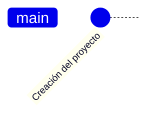

# PreEII

Software de soporte de revisión de pre-matrículas para la escuela de ingeniería industrial
/
Pre-enrollment review support software for the school of industrial engineering

## ¿Qué es PreEII?

PreEII, significa Pre-matrículas de Escuela de Ingeniería Industrial.  
Este software es la evolución de un software que nació por la necesidad
de reducir el tiempo de revisión de las prematrículas. Las primeras
versiones fueron realizadas en Java, que imprimía los resutados en la consola.
Posteriormente se hizo un script en Python 2 que tomaba una plantilla de Excel
que literalmente pintaba los cursos. En esta versión se hacía la revisión uno
por uno, a través del "copy" de los contenidos del informe de cada estudiante
en el navegador. Luego se ejecutaba el "script", que leía el "clipboard" de la
memoria de acceso aleatorio (RAM). Esto aunque ayudaba bastante a la revisión,
resultaba un tedioso.

Por lo que se rediseña una nueva versión, utilizando Python 3. También se mejoró
la generación de la salida, al crear un Excel desde cero sin necesidad de
utilizar una plantilla. Pero el mayor beneficio de esta versión, es que se
digite la credenciales y descarga todos los expedientes asigandos al docente.
Esta versión está diseñada en "consola". Esta aplicación guarda la información
en archivos de texto y archivos de Excel.

Por lo que se considerá después de compartir este software que se todavía se
pueden hacer mejoras significativas. Entre las cuales, se irán implementando
de forma paulatina. Acá se hace un resumen de las nuevas características a
implementar:

1. UI, se está diseñando una interfaz gráfica, donde cada usuario pueda interactuar
   con la aplicación a través del ratón.
2. Incorporación de una base de datos, para almacenar los datos. Este tiene como
   fin poder comparar si hay cambios en cada "descarga" de los datos. Para indicar
   al usuario que elementos debería de revisar.
3. Revisión en pantalla, sin necesidad de generar archivos de Excel.
4. Generación opcional y bajo demanda de los informes en Excel.
5. Generación de gráficos para facilitar la revisión y poder comparar entre estudiantes
   cogeneracionales.
6. Control del versionamiento a través de llaves de activación. Esto facilita que todos
   quienes usen este software tengan las últimas versiones y evitar que se ejecuten
   versiones antiguas.
7. Distribución del software a través del Python Package Index (PyPI), conocido como "pip",
   dado que muchos de los potenciales usuarios no poseen conocimiento sobre programación
   en Python. La anterior forma de "compartir la aplicación" requería ejecutar muchas
   tareas técnicas.

## Características técnicas de la aplicación

Este software está desarrollado con:

1. Python 3.10 (o superior)
2. PySide 6 (QT para Python)
3. SQLite 3

## Roadmap

Este es un resumen de las liberaciones del software.

## Características por implementar

- [ ] Empaquetado del PIP
- [ ] UI: Prueba y diseño de las interfaz general de la aplicación
    1.
        - [ ] Pruebas de QT
    1.
        - [ ] Pruebas de instalación automática en PIP
- [ ] Base de datos
    1.
        - [ ] Diseño de la base de datos
    1.
        - [ ] Carga de datos básicos
    1.
        - [ ] Diseño de triggers de la base de datos
- [ ] Web scrapting
- [ ] Multisede
- [ ] Análisis en pantalla
- [ ] Gráficos en pantalla
- [ ] Multicarrera
- [ ] Reportes en excel
- [ ] Multiusuario
