<div align="center">

# 🏛️ Pydddi

**Pydantic-powered Domain-Driven Design Interfaces**

*A modern Python library for building clean, type-safe DDD applications*

[](https://python.org)
[](https://pydantic.dev)
[](LICENSE)
[](https://python-poetry.org)

---

*Transform your Python applications with enterprise-grade DDD patterns* 🚀

</div>

## ✨ What is Pydddi?

Pydddi brings the power of **Domain-Driven Design** to Python with **type safety** at its core. Built on top of Pydantic, it provides clean interfaces and patterns that make your code more maintainable, testable, and scalable.

### 🎯 Why Choose Pydddi?

| Feature | Benefit |
|---------|---------|
| 🔒 **Type Safety** | Catch errors at development time with Pydantic validation |
| 🏗️ **Clean Architecture** | Enforce separation of concerns with clear layer boundaries |
| 🧩 **Modular Design** | Mix and match interfaces based on your needs |
| ⚡ **Modern Python** | Leverages Python 3.12+ features for optimal performance |
| 📖 **Self-Documenting** | Interfaces serve as living documentation |

## 🚀 Features

<table>
<tr>
<td width="50%">

### 🏛️ **Domain Layer**
- Type-safe entities with identity
- Value objects using Pydantic
- Domain service abstractions
- Rich domain modeling

</td>
<td width="50%">

### ⚙️ **Application Layer**
- Command/Result pattern
- Use case interfaces
- Structured error handling
- Business workflow orchestration

</td>
</tr>
<tr>
<td>

### 🗄️ **Infrastructure Layer**
- Repository patterns (CRUD, Read, Aggregate)
- Schema-based operations
- Database abstraction
- External service integration

</td>
<td>

### 🧪 **Developer Experience**
- Full type hints support
- IDE autocompletion
- Runtime validation
- Clear error messages

</td>
</tr>
</table>

## 📦 Quick Start

```bash
# Install the package
pip install pydantic-ddd-interface
```

```python
# Start building your domain
from pydddi import IEntity, IUseCase, ICrudRepository

# You're ready to build enterprise-grade applications! 🎉
```

---

## 🔧 Usage Examples

> 💡 **Tip**: Each layer has a specific responsibility. Start with the domain and work your way out!

### 🏛️ Domain Layer
*Define your business entities and value objects*

```python
from pydddi import IEntity, IModel

class User(IEntity[int]):
    """Lightweight user entity - just identity and core attributes"""
    id: int
    name: str
    email: str
    
    def get_id(self) -> int:
        return self.id

class UserProfile(IModel):
    """Heavy model with relationships - used in domain logic processing"""
    user: User
    posts: List["Post"]
    followers: List["User"]
    settings: "UserSettings"
    activity_history: List["ActivityLog"]
    
    # Domain logic methods can access all related data
    def get_total_engagement(self) -> int:
        return sum(post.likes + post.comments for post in self.posts)
```

### ⚙️ Application Layer  
*Orchestrate business workflows with use cases*

```python
from pydddi import IUseCase, IUseCaseCommand, IUseCaseResult

class CreateUserCommand(IUseCaseCommand):
    """Command to create a new user"""
    name: str
    email: str

class CreateUserResult(IUseCaseResult):
    """Result of user creation"""
    user_id: int
    success: bool
    message: str

class CreateUserUseCase(IUseCase[CreateUserCommand, CreateUserResult]):
    """Use case for creating users with business validation"""
    
    async def execute(self, command: CreateUserCommand) -> CreateUserResult:
        # Your business logic here
        # - Validate email uniqueness
        # - Apply business rules
        # - Persist user
        pass
```

### 🗄️ Infrastructure Layer
*Handle data persistence and external integrations*

```python
from pydddi import ICrudRepository, IReadRepository, IReadAggregateRepository
from pydddi import ICreateSchema, IUpdateSchema

class UserCreateSchema(ICreateSchema):
    """Schema for user creation"""
    name: str
    email: str

class UserUpdateSchema(IUpdateSchema):
    """Schema for user updates"""
    name: str | None = None
    email: str | None = None
```

<details>
<summary>🔍 <strong>Click to see repository implementations</strong></summary>

```python
# 🔨 CRUD Repository - for lightweight entity operations
class UserCrudRepository(ICrudRepository[User, UserCreateSchema, User, UserUpdateSchema]):
    async def create(self, schema: UserCreateSchema) -> User:
        """Create a new user entity (lightweight)"""
        pass
    
    async def read(self, id: int) -> User:
        """Get user entity by ID (no relationships)"""
        pass
    
    # ... other CRUD methods

# 📖 Read Repository - for simple read operations on lightweight entities  
class UserReadRepository(IReadRepository[User, User]):
    async def read(self, id: int) -> User:
        """Get user entity without relationships"""
        pass
    
    async def list(self, limit: int = None, **filters) -> List[User]:
        """List user entities (lightweight)"""
        pass

# 🔗 Read Aggregate Repository - for heavy models with full relationships
class UserProfileRepository(IReadAggregateRepository[UserProfile, User]):
    async def read(self, id: int) -> UserProfile:
        """Get heavy UserProfile with all related data (posts, followers, etc.)"""
        pass
    
    async def list(self, limit: int = None, **filters) -> List[UserProfile]:
        """List UserProfile with full relationship data for domain processing"""
        pass
```

</details>

---

## 🏗️ Architecture Overview

```mermaid
graph TB
    subgraph "🖥️ Presentation Layer"
        API[REST API / GraphQL]
        CLI[CLI Commands]
    end
    
    subgraph "⚙️ Application Layer"
        UC[Use Cases]
        CMD[Commands & Results]
    end
    
    subgraph "🏛️ Domain Layer"
        ENT[Entities]
        VO[Value Objects]
        DS[Domain Services]
    end
    
    subgraph "🗄️ Infrastructure Layer"
        REPO[Repositories]
        DB[(Database)]
        EXT[External APIs]
    end
    
    API --> UC
    CLI --> UC
    UC --> ENT
    UC --> REPO
    REPO --> DB
    REPO --> EXT
    
    style UC fill:#e1f5fe
    style ENT fill:#f3e5f5
    style REPO fill:#e8f5e8
```

<div align="center">



</div>

### 🎯 Design Principles

| Principle | Implementation |
|-----------|----------------|
| **🔒 Dependency Inversion** | Infrastructure depends on domain abstractions |
| **🧩 Single Responsibility** | Each interface has one clear purpose |
| **⚡ Open/Closed** | Extend behavior without modifying existing code |
| **🎭 Interface Segregation** | Small, focused interfaces over large ones |

---

## 📚 API Reference

<details>
<summary>🏛️ <strong>Domain Layer APIs</strong></summary>

### Entities & Models
- **`IEntity`** - Base class for entities with identity and lifecycle
- **`IModel`** - Base class for value objects using Pydantic validation
- **`IDomainService`** - Interface for domain services containing business logic

</details>

<details>
<summary>⚙️ <strong>Application Layer APIs</strong></summary>

### Use Cases & Commands
- **`IUseCase[TCommand, TResult]`** - Generic interface for business use cases
- **`IUseCaseCommand`** - Base class for use case input commands
- **`IUseCaseResult`** - Base class for use case output results

### Exception Handling
- **`UseCaseError`** - Base exception for use case operations
- **`UseCaseCommandError`** - Command validation errors
- **`UseCaseResultError`** - Result validation errors  
- **`UseCaseExecutionError`** - Execution-time errors

</details>

<details>
<summary>🗄️ <strong>Infrastructure Layer APIs</strong></summary>

### Repository Patterns
- **`ICrudRepository[TEntity, TCreateSchema, TReadSchema, TUpdateSchema]`** - Full CRUD operations
- **`IReadRepository[TEntity, TReadSchema]`** - Read-only operations for entities
- **`IReadAggregateRepository[TModel, TReadAggregateSchema]`** - Complex reads with relationships

### Data Schemas
- **`ICreateSchema`** - Schema for create operations
- **`IReadSchema`** - Schema for read operations  
- **`IUpdateSchema`** - Schema for update operations
- **`IReadAggregateSchema`** - Schema for aggregate read operations

### Exception Handling
- **`RepositoryError`** - Base repository exception
- **`RecordNotFoundError`** - Entity not found errors
- **`DuplicateRecordError`** - Duplicate entity errors

</details>

### 🎯 Repository Usage Guide

| Repository Type | Use Case | Returns | Example | Weight |
|----------------|----------|---------|---------|--------|
| **ICrudRepository** | Lightweight entity lifecycle | `IEntity` | User CRUD operations | 🪶 Light |
| **IReadRepository** | Simple entity queries | `IEntity` | User identity lookup | 🪶 Light |
| **IReadAggregateRepository** | Heavy models with relationships | `IModel` | UserProfile with posts/followers | 🏋️ Heavy |

---

## 🤝 Contributing

We welcome contributions! Here's how you can help:

<div align="center">

| 🐛 **Found a Bug?** | 💡 **Have an Idea?** | 📖 **Improve Docs?** |
|:---:|:---:|:---:|
| [Open an Issue](../../issues) | [Start a Discussion](../../discussions) | [Submit a PR](../../pulls) |

</div>

### 🛠️ Development Setup

```bash
# Clone the repository
git clone https://github.com/nodashin/pydantic-ddd-interface.git
cd pydantic-ddd-interface

# Install dependencies
poetry install

# Run tests
poetry run pytest

# Format code
poetry run black .
```

---

<div align="center">

## 📄 License

This project is licensed under the **MIT License** - see the [LICENSE](LICENSE) file for details.

---

<div align="center">
  
**Made with ❤️ for the Python DDD community**

*Star ⭐ this repo if you find it useful!*

</div>

</div>
