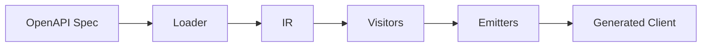

# Architecture Overview

PyOpenAPI Generator follows a three-stage pipeline: Load → Visit → Emit. This document explains the core components and data flow.

## System Overview



The generator transforms OpenAPI specifications into self-contained Python clients through a clean separation of concerns.

## Core Components

### 1. Loader System (`core/loader/` & `core/parsing/`)
Transforms OpenAPI specs into typed Intermediate Representation:
- **Unified Cycle Detection**: Handles complex schema relationships and recursion
- **Schema Parser**: Core parsing logic with reference resolution
- **Keyword Processors**: Specialized handlers for `allOf`, `oneOf`, `anyOf`
- **Transformers**: Extract inline enums, promote nested objects

### 2. Intermediate Representation (IR)
Typed dataclasses representing normalized OpenAPI components:
- `IRSpec`, `IROperation`, `IRSchema`, `IRParameter`
- Stable interface between parsing and code generation
- All generation based on IR, not raw spec

### 3. Unified Type Resolution System (`types/`)
**NEW**: Centralized, testable type resolution architecture:
- **Contracts** (`types/contracts/`): Protocols and interfaces for type resolution
- **Resolvers** (`types/resolvers/`): Core resolution logic for schemas, responses, and references
- **Services** (`types/services/`): High-level orchestration with `UnifiedTypeService`
- **Clean Architecture**: Dependency inversion with protocols, full test coverage
- **Consistent Resolution**: Single source of truth for all type resolution across the codebase

### 4. Visitor System (`visit/`)
Implements visitor pattern for code generation:
- **ModelVisitor**: Python dataclasses/enums from schemas
- **EndpointVisitor**: Async methods from operations  
- **ClientVisitor**: Main API client class
- **ExceptionVisitor**: Error hierarchies

### 5. Emitter System (`emitters/`)
Orchestrates file generation:
- **ModelsEmitter**: Creates `models/` directory
- **EndpointsEmitter**: Creates `endpoints/` with operations
- **CoreEmitter**: Copies runtime dependencies
- **ClientEmitter**: Main client interface

### 6. Supporting Systems
- **Context** (`context/`): Manages rendering state and imports
- **Writers** (`core/writers/`): Code formatting utilities
- **Helpers** (`helpers/`): Legacy type resolution (now delegates to unified system)

## Generation Pipeline

```
OpenAPI Spec → IR → Unified Type Resolution → Code → Files
```

1. **Load**: Parse YAML/JSON spec into `IRSpec` with cycle detection
2. **Resolve**: Convert IR schemas/responses to Python types via `UnifiedTypeService`
3. **Visit**: Transform IR nodes into Python code strings
4. **Emit**: Write structured package with proper imports  
5. **Post-process**: Format and type-check generated code

## Unified Type Resolution Architecture

**NEW**: The `types/` package provides centralized type resolution:

### Key Components
- **`UnifiedTypeService`**: Main entry point for all type resolution
- **Schema Resolver**: Handles IRSchema → Python type conversion
- **Response Resolver**: Handles IRResponse → Python type conversion  
- **Reference Resolver**: Handles `$ref` resolution across schemas and responses
- **Protocol-Based Design**: Clean interfaces enabling testing and extensibility

### Benefits
- **Consistency**: Single source of truth for type resolution logic
- **Testability**: Clean architecture with dependency injection
- **Maintainability**: Separation of concerns with clear contracts
- **Extensibility**: Protocol-based design allows easy additions

### Usage Example
```python
from pyopenapi_gen.types.services import UnifiedTypeService

# Initialize with all schemas
type_service = UnifiedTypeService(schemas, responses)

# Resolve schema to Python type
python_type = type_service.resolve_schema_type(schema, context, required=True)

# Resolve operation response
response_type = type_service.resolve_operation_response_type(operation, context)
```

## Unified Cycle Detection

Critical system preventing infinite recursion during schema parsing:

### Detection Types
- **Structural Cycles**: Reference loops (A → B → A)
- **Self-References**: Direct self-references (A → A)  
- **Depth Limits**: Configurable recursion limits

### Resolution Strategies
- **Referential Stubs**: For allowed self-references
- **Placeholders**: For problematic cycles and depth exceeded
- **State Tracking**: Schema lifecycle management

Implementation in `core/parsing/unified_cycle_detection.py` provides conflict-free detection across all parsing scenarios.

## Development Workflow

### Quality Assurance

The project enforces high code quality standards through automated tooling:

```bash
# Before any commit - auto-fix issues
make quality-fix

# Verify all quality gates pass (matches CI pipeline)
make quality
```

#### Quality Tools

- **Black**: Code formatting (120 char line length)
- **Ruff**: Fast Python linter with auto-fix capabilities
- **mypy**: Strict type checking with 100% coverage
- **Bandit**: Security vulnerability scanning
- **pytest**: Comprehensive test suite with ≥90% branch coverage

#### Individual Commands

```bash
make format               # Auto-format code
make lint-fix             # Auto-fix linting issues
make typecheck            # Type checking
make security             # Security scanning
make test                 # Run all tests
make test-cov             # Run tests with coverage
```

### Testing Strategy

The project follows a comprehensive testing approach:

- **Unit Tests**: Component-specific tests with high coverage
- **Integration Tests**: End-to-end generation workflows
- **Type Safety**: Full mypy coverage ensures type correctness
- **Quality Gates**: All checks must pass before merge

### CI/CD Integration

The `make quality` command exactly matches the GitHub Actions pipeline, ensuring local development aligns with CI requirements. This prevents "works on my machine" issues and provides fast feedback during development. 