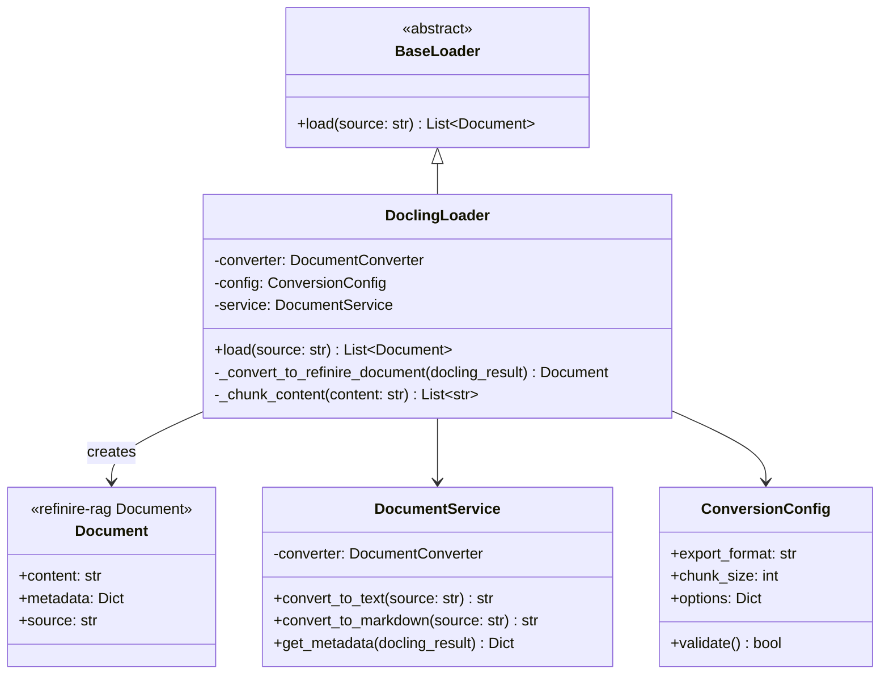

# アーキテクチャ設計 - Refinire-RAG Docling Plugin

## 概要
refinire-ragのLoaderプラグインとして、DoclingライブラリをラップしてRAGシステムで利用可能にする。

## 設計原則
- **単一責任原則**: 各クラスは200行以内、1つの責務のみ
- **DRY原則**: 重複コードを共通ユーティリティに抽出
- **セキュリティ**: 入力は必ずバリデーション層で検証

## 調査結果まとめ

### Docling機能
- **対応形式**: PDF, DOCX, XLSX, HTML, 画像
- **主要クラス**: DocumentConverter, DoclingDocument
- **出力形式**: Markdown, HTML, JSON
- **特徴**: 高度なPDF理解、OCRサポート、テーブル構造認識

## クラス設計テーブル

| クラス名 | 責務 | 主要属性 | 主要メソッド |
|---------|------|----------|-------------|
| DoclingLoader | refinire-rag統合、文書読み込み制御 | converter, config, service | load(), _process_document() |
| DocumentService | Docling変換のビジネスロジック | converter: DocumentConverter | convert_to_text(), extract_metadata() |
| ConversionConfig | 変換設定管理 | export_format, chunk_size, options | validate(), to_dict() |

## Mermaidクラス図

## 依存関係の流れ

1. DoclingLoader.load() → DocumentService.convert_to_text/markdown()
2. Doclingの結果 → refinire-ragのDocument型に変換
3. テキストチャンク化（必要に応じて）
4. List[Document]として返却

## 凝集度・結合度チェック

- **DoclingLoader**: 単一責任（RAG統合のみ）
- **DocumentService**: 単一責任（Docling変換のみ）
- **ConversionConfig**: 単一責任（設定管理のみ）
- 各クラス間の結合は最小限に抑制