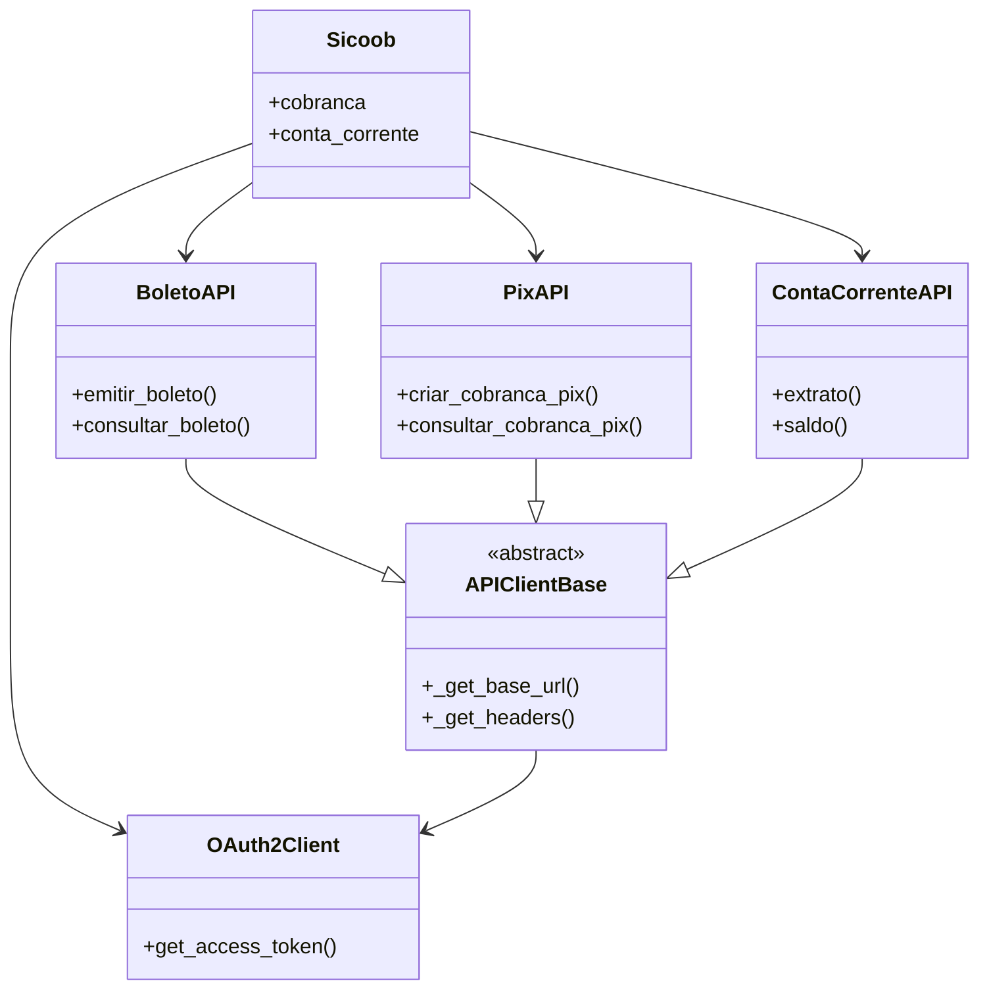

# Sicoob SDK Python

SDK Python para integração com a API do Banco Sicoob

## Instalação

```bash
pip install -r requirements.txt
# ou
pip install -e .
```

## Configuração

Crie um arquivo `.env` na raiz do projeto com as seguintes variáveis:

```ini
SICOOB_CLIENT_ID=seu_client_id
SICOOB_CERTIFICADO=caminho/para/certificado.pem
SICOOB_CHAVE_PRIVADA=caminho/para/chave_privada.key
```

## Uso Básico

```python
from sicoob import Sicoob

# Inicializa o cliente
cliente = Sicoob(
    client_id="seu_client_id",
    certificado="caminho/para/certificado.pem", 
    chave_privada="caminho/para/chave_privada.key"
)

# Exemplo: consulta de extratos
extrato = cliente.conta_corrente.consulta_extrato(conta="12345", data_inicio="2023-01-01", data_fim="2023-01-31")
```

## API de Boletos

A classe `BoletoAPI` permite emitir e consultar boletos bancários:

```python
from sicoob import Sicoob

# Inicializa o cliente
cliente = Sicoob(
    client_id="seu_client_id",
    certificado="caminho/para/certificado.pem",
    chave_privada="caminho/para/chave_privada.key"
)

# Obtém instância do BoletoAPI
boleto_api = cliente.boleto()

# Emitir boleto
dados_boleto = {
    "numeroContrato": 123456,
    "modalidade": 1,
    "valor": 100.50,
    "beneficiario": {
        "nome": "Nome Beneficiário",
        "documento": "12345678901"
    }
}
boleto = boleto_api.emitir_boleto(dados_boleto)

# Consultar boleto
nosso_numero = boleto["nossoNumero"]
boleto_consultado = boleto_api.consultar_boleto(nosso_numero)
```

### Tratamento de Erros

A API trata os seguintes casos de erro:
- **404 Not Found**: Retorna `None` quando o boleto não existe
- **Erros HTTP (400, 500, etc)**: Levanta exceção com código e mensagem
- **Erros de conexão**: Levanta exceção com detalhes do erro

## Versionamento e Deploy

O projeto segue [Semantic Versioning](https://semver.org/). Para criar um novo release:

1. Atualize a versão em:
   - `setup.py`
   - `pyproject.toml`
   - `sicoob/__init__.py`

2. Execute os testes:
```bash
make test
```

3. Crie um novo release no GitHub:
   - Acesse "Releases" no repositório
   - Clique em "Draft a new release"
   - Defina a tag no formato `vX.Y.Z` (ex: `v0.1.3`)
   - O GitHub Actions irá automaticamente:
     - Construir o pacote (`make build`)
     - Publicar no PyPI (`make publish`)

### Comandos Úteis
```bash
# Construir pacote
make build

# Executar testes
make test

# Publicar no PyPI (requer TWINE_USERNAME e TWINE_PASSWORD)
make publish

# Incrementar versão (patch, minor ou major)
make bump-patch   # Incrementa patch version (0.1.2 → 0.1.3)
make bump-minor   # Incrementa minor version (0.1.2 → 0.2.0)
make bump-major   # Incrementa major version (0.1.2 → 1.0.0)
```

### Como Incrementar a Versão
1. Execute o comando apropriado:
```bash
make bump-patch   # Para correções de bugs
make bump-minor   # Para novas funcionalidades compatíveis
make bump-major   # Para mudanças incompatíveis
```

2. Verifique as alterações nos arquivos:
```bash
git diff
```

3. Commit e push das alterações:
```bash
git add .
git commit -m "Bump version to X.Y.Z"
git push
```

## Links Úteis

- [Documentação API Sicoob](https://developers.sicoob.com.br)
- [Portal de Desenvolvedores](https://developers.sicoob.com.br/portal)

## Documentação Técnica

### Visão Geral
Biblioteca Python para integração com a API do Banco Sicoob, incluindo:
- Autenticação OAuth2
- Cobrança (Boletos e PIX)
- Conta Corrente
- Operações bancárias

### Índice
1. [Classe Principal](#classe-sicoob)
2. [Autenticação](#autenticação-oauth2)
3. [Serviços](#serviços)
   - [Boletos](#api-de-boletos)
   - [PIX](#api-de-pix)
   - [Conta Corrente](#api-de-conta-corrente)
4. [Classe Base](#classe-base)
5. [Diagrama de Relacionamentos](#diagrama-de-relacionamentos)
6. [Exemplos de Uso](#exemplos-de-uso)

---

### Classe Sicoob
Cliente principal que fornece acesso a todos os serviços.

**Arquivo:** `sicoob/client.py`

#### Métodos:
- `__init__(client_id=None, certificado=None, chave_privada=None, sandbox_mode=False)`
  - Inicializa o cliente com credenciais
  - Parâmetros:
    - `client_id`: Client ID fornecido pelo Sicoob
    - `certificado`: Caminho para o certificado .pem
    - `chave_privada`: Caminho para a chave privada .key  
    - `sandbox_mode`: Se True, usa ambiente sandbox (default: False)

#### Propriedades:
- `cobranca`: Acesso às APIs de Cobrança (Boleto e PIX)
- `conta_corrente`: Acesso à API de Conta Corrente

---

### Autenticação OAuth2
**Arquivo:** `sicoob/auth/oauth.py`

#### Classe: OAuth2Client
Gerencia tokens de acesso com escopos específicos.

#### Métodos:
- `get_access_token(scope=None)`: Obtém token para o escopo especificado
- `_is_token_expired(scope)`: Verifica se token expirou (método interno)

#### Escopos Comuns:
- **Boletos**: `"boletos_inclusao boletos_consulta..."`
- **Conta Corrente**: `"cco_consulta cco_transferencias..."`
- **PIX**: `"cob.write cob.read..."`

---

### Serviços

#### API de Boletos
**Arquivo:** `sicoob/boleto.py`

#### Classe: BoletoAPI
Operações com boletos bancários.

#### Métodos:
- `emitir_boleto(dados_boleto)`: Emite novo boleto
- `emitir_segunda_via()`: Emite segunda via de um boleto existente
- `consultar_boleto(nosso_numero)`: Consulta boleto existente
- `consultar_boletos_por_pagador()`: Consulta lista de boletos por pagador
- `consultar_faixas_nosso_numero()`: Consulta faixas de nosso número disponíveis
- `alterar_boleto()`: Altera dados de um boleto existente
- `alterar_pagador()`: Altera informações do cadastro do pagador
- `baixar_boleto()`: Comanda a baixa de um boleto existente
- `cadastrar_webhook()`: Cadastra um webhook para receber notificações
- `consultar_webhook()`: Consulta os detalhes de um webhook cadastrado
- `atualizar_webhook()`: Atualiza um webhook cadastrado
- `excluir_webhook()`: Remove permanentemente um webhook cadastrado
- `consultar_solicitacoes_webhook()`: Consulta as solicitações de notificação

#### API de PIX
**Arquivo:** `sicoob/pix.py`

#### Classe: PixAPI
Operações com PIX.

#### Métodos Principais:
- `criar_cobranca_pix(txid, dados)`: Cria cobrança imediata
- `consultar_cobranca_pix(txid)`: Consulta cobrança
- `configurar_webhook(chave, url)`: Configura webhook

#### API de Conta Corrente
**Arquivo:** `sicoob/conta_corrente.py`

#### Classe: ContaCorrenteAPI
Operações bancárias.

#### Métodos:
- `extrato()`: Obtém extrato por período
- `saldo()`: Consulta saldo
- `transferencia()`: Realiza transferência

---

### Classe Base
**Arquivo:** `sicoob/api_client.py`

#### Classe: APIClientBase
Fornece funcionalidades comuns a todas as APIs.

#### Métodos:
- `_get_base_url()`: Retorna URL conforme sandbox/produção
- `_get_headers(scope)`: Retorna headers com autenticação

---

### Diagrama de Relacionamentos



---

### Exemplos de Uso

```python
from sicoob import Sicoob
from sicoob.auth import OAuth2Client
import requests

# Configuração
oauth = OAuth2Client(client_id, certificado, chave)
session = requests.Session()
sicoob = Sicoob(oauth_client=oauth, session=session)

# Uso dos serviços
extrato = sicoob.conta_corrente.extrato(
    mes=6, ano=2025, dia_inicial=1, dia_final=30, 
    numero_conta_corrente=123456
)

boleto = sicoob.cobranca.boleto.emitir_boleto({
    "numeroContrato": 123456,
    "modalidade": 1,
    "valor": 100.50
})

pix = sicoob.cobranca.pix.criar_cobranca_pix(
    "tx123", 
    {"valor": {"original": "100.50"}}
)
