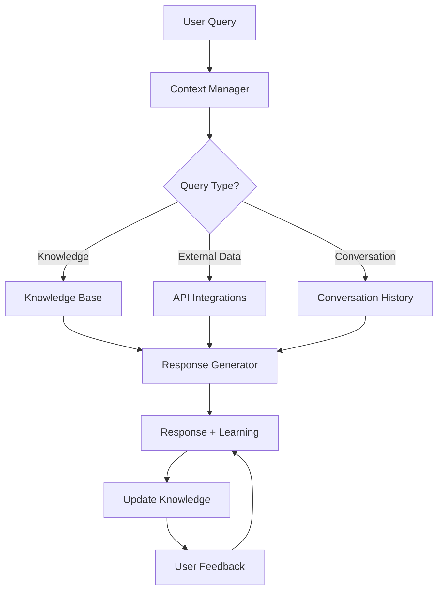

# Sifu - Advanced Knowledge and NLP Support System

[](https://www.python.org/downloads/)
[](https://opensource.org/licenses/Apache 2.0 )
[](https://sifu-ai.readthedocs.io/)
[](https://github.com/psf/black)

Sifu is an advanced knowledge and natural language processing system designed to enhance AI assistants with sophisticated context handling, real-time learning, and multi-language support.

## 🌟 Features

- **Advanced NLP**: Intent recognition and entity extraction
- **Knowledge Management**: Store and retrieve information with confidence scoring
- **Context Awareness**: Maintain conversation context and history
- **Multi-language Support**: Automatic language detection and translation
- **Learning Engine**: Improve responses through feedback
- **RESTful API**: Easy integration with existing systems
- **Modular Architecture**: Extensible design for custom components

## 🚀 Quick Start

### Prerequisites

- Python 3.8+
- [Poetry](https://python-poetry.org/) for dependency management
- (Optional) GPU for better ML performance

### Installation

1. Clone the repository:
   ```bash
   git clone https://github.com/yourusername/sifu.git
   cd sifu
   ```

2. Install dependencies using Poetry:
   ```bash
   poetry install
   ```

   Or install with pip:
   ```bash
   pip install -r requirements.txt
   ```

3. Install language models (for NLP features):
   ```bash
   python -m spacy download en_core_web_sm
   ```

### Basic Usage

```python
from sifu import Sifu
import asyncio

async def main():
    # Initialize Sifu
    sifu = Sifu()
    
    # Process a query
    response = await sifu.process_query("Hello, what can you do?")
    print(f"Response: {response['text']}")
    
    # Add knowledge
    await sifu.knowledge_base.add_entry(
        content="Sifu is an AI assistant",
        tags=["introduction"],
        language="en"
    )

if __name__ == "__main__":
    asyncio.run(main())
```

## 📚 Documentation

For detailed documentation, please visit our [documentation site](https://sifu-ai.readthedocs.io/).

### Key Components

- [Knowledge Base](docs/knowledge.md): Store and retrieve information
- [Context Management](docs/context.md): Handle conversation state
- [Intent Matcher](docs/matcher.md): Understand user intents
- [Learning Engine](docs/learning.md): Improve through feedback
- [API Reference](docs/api.md): REST API documentation

## 🧪 Testing

Run the test suite:

```bash
# Install test dependencies
poetry install --with test

# Run tests
pytest tests/ -v

# Run with coverage
pytest --cov=sifu --cov-report=term-missing
```

## 🤝 Contributing

Contributions are welcome! Please read our [Contributing Guide](CONTRIBUTING.md) for details.

## 📄 License

This project is licensed under the Apache 2.0  License - see the [LICENSE](LICENSE) file for details.

## 📞 Contact

For questions or support, please open an issue or contact [your-email@example.com](mailto:your-email@example.com).

---

<p align="center">
  Made with ❤️ by Your Name
</p> for ELLMa

## Core Components

### 1. Knowledge Management System
- **SimpleKnowledgeBase**: Core knowledge storage with confidence scoring and continuous learning
- **Context Manager**: Handles conversation history and context awareness
- **Response Generator**: Multi-strategy response generation with fallback mechanisms

### 2. Advanced Features
- **Real-time Learning**: Learns from interactions and feedback
- **Multi-language Support**: Built-in support for multiple languages
- **User Profiles**: Personalized knowledge and preferences
- **External API Integration**: Access to real-time information
- **FastAPI-based API**: Easy integration with other systems

## Documentation

### Architecture



### Key Algorithms

1. **Context-Aware Response Generation**
   - Uses conversation history and user context
   - Implements attention mechanisms for better context understanding
   - [Learn more](docs/context_handling.md)

2. **Pattern Matching with NLP**
   - Advanced NLP techniques for intent recognition
   - Support for fuzzy matching and semantic similarity
   - [Learn more](docs/pattern_matching.md)

3. **Real-time Learning Loop**
   - Continuous learning from interactions
   - Confidence-based knowledge updates
   - [Learn more](docs/learning_loop.md)

4. **Multi-language Processing**
   - Language detection and translation
   - Culture-aware responses
   - [Learn more](docs/multilingual.md)

## Getting Started

### Prerequisites
- Python 3.8+
- Poetry for dependency management
- Redis (for caching and real-time features)

### Installation

```bash
# Clone the repository
git clone https://github.com/yourusername/sifu.git
cd sifu

# Install dependencies
poetry install

# Set up environment variables
cp .env.example .env
# Edit .env with your configuration

# Run the development server
poetry run uvicorn sifu.api:app --reload
```

## API Documentation

Once the server is running, access the interactive API documentation at:
- Swagger UI: http://localhost:8000/docs
- ReDoc: http://localhost:8000/redoc

## Usage Examples

### Basic Usage

```python
from sifu import Sifu

# Initialize Sifu
sifu = Sifu()

# Process a query
response = sifu.process_query("What's the weather like today?")
print(response)

# Provide feedback
sifu.provide_feedback(
    question="What's the weather like today?",
    rating=1,
    better_response="The current weather is sunny with a temperature of 22°C."
)
```

### Advanced Usage with Custom Knowledge Sources

```python
from sifu import Sifu
from sifu.knowledge import WebSource, APISource

# Initialize with custom knowledge sources
sifu = Sifu(
    knowledge_sources=[
        WebSource(),
        APISource("weather_api", "https://api.weatherapi.com/v1")
    ]
)

# Process a query with context
response = sifu.process_query(
    "What's the weather in Tokyo?",
    context={"user_id": "123", "language": "en"}
)
print(response)
```

## Configuration

Configuration is handled through environment variables. Copy `.env.example` to `.env` and adjust the settings as needed.

```env
# Database
DATABASE_URL=sqlite:///./sifu.db
REDIS_URL=redis://localhost:6379/0

# API Keys (if using external services)
OPENAI_API_KEY=your_openai_key
WEATHER_API_KEY=your_weather_api_key

# Application Settings
DEBUG=True
LOG_LEVEL=INFO
```

## Contributing

1. Fork the repository
2. Create a new branch (`git checkout -b feature/your-feature`)
3. Commit your changes (`git commit -am 'Add some feature'`)
4. Push to the branch (`git push origin feature/your-feature`)
5. Create a new Pull Request

## License

This project is licensed under the Apache 2.0  License - see the [LICENSE](LICENSE) file for details.

## Acknowledgements

- Built with ❤️ for the ELLMa project
- Uses FastAPI for the web framework
- Integrates with various NLP and ML libraries
